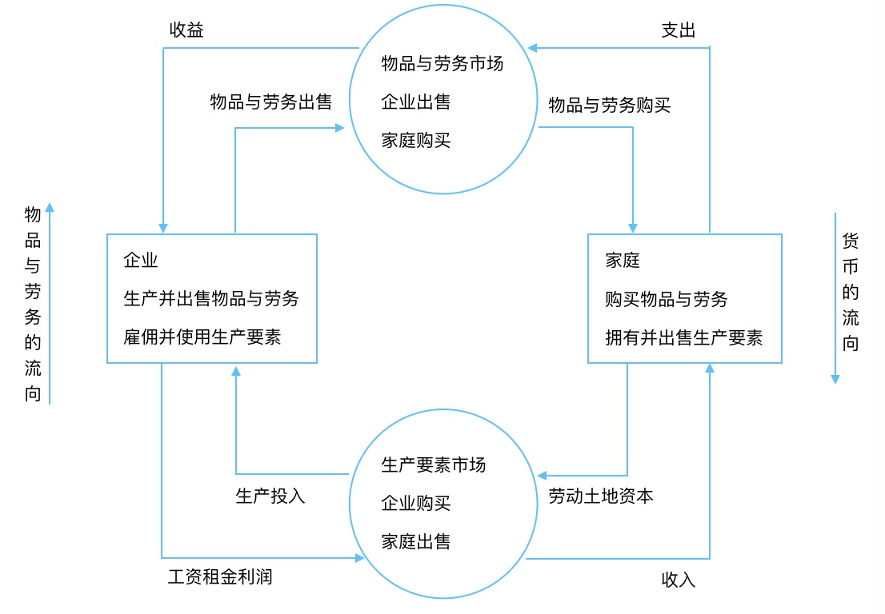
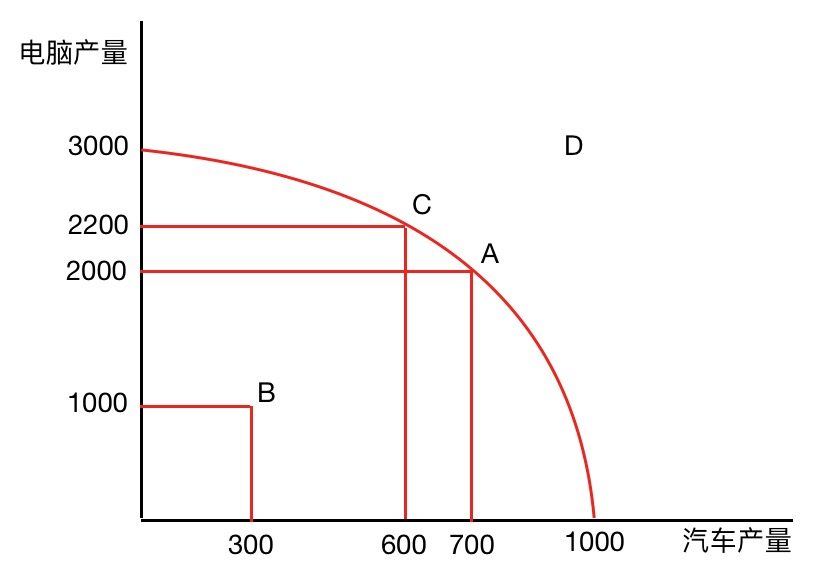
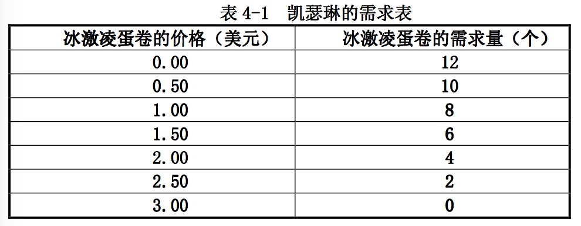
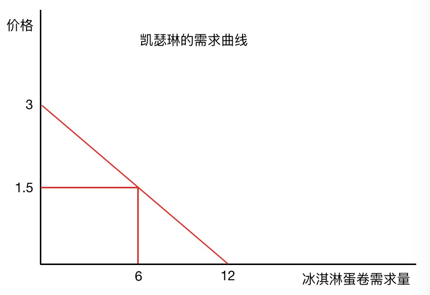
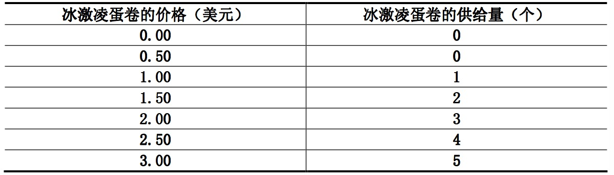
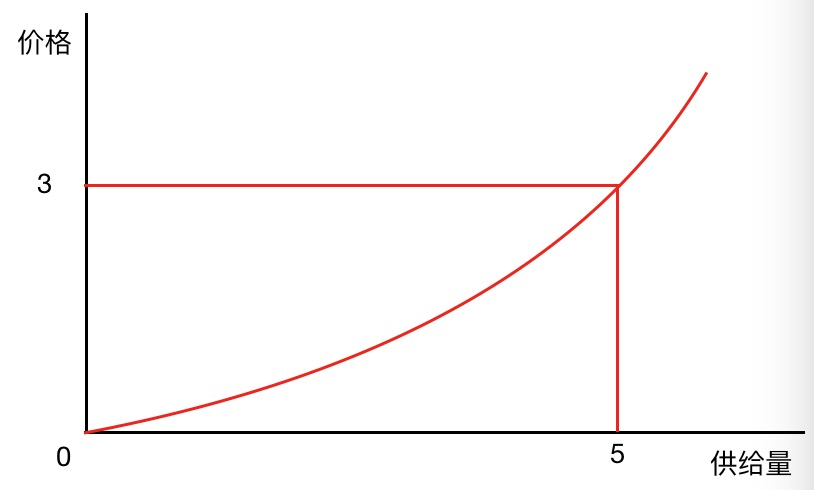
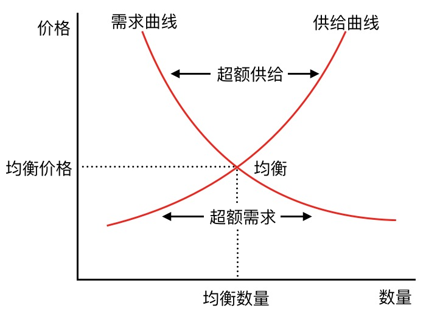

## 第一章

> 经济来源于希腊语，其意为“管理一个家庭的人”，家庭必须考虑每个人的能力，努力和愿望去分配稀缺性资源，社会同样如此。稀缺性指的是社会提供的东西少于人们的想拥有的。经济学就是研究社会如何管理自己的稀缺性资源

### 人们如何作出决策

#### 人们面临交替关系

* 在人们组成社会时，会面临多种交替关系选择，其中一种典型的交替关系为“大炮与黄油”，当我们把更多的钱用于保卫国家免受入侵（大炮）时，能用于提高国内生活水平和消费能力的钱（黄油）就少了。
* 社会中面临的另外一种重要的交替关系是效率和公平，效率是指社会能从稀缺性资源得到最多的东西，公平是指将资源平等分配给社会成员，换言之，效率是指经济蛋糕的大小，而公平是指如何分配这蛋糕。在设计政府政策时，这两个目标不是一致的，例如个人所得税，该政策要求事业成功的人付出更多，以求公平，但反之，相当于变相减少了对辛勤工作的奖励，打压了积极性，结果，人们工作少了，生产的物品与劳务也少了，效率随之下降。所以，当政府越发想要将经济蛋糕切得更均匀更小，经济蛋糕反而会变小。

#### 某种东西的成本是为了得到它而放弃的东西

* 该成本称为机会成本
* 面临交替关系，作出的决策要考虑成本和收益，但很多情况下，某种行动的成本并不像咋看之下那么明显
* 例如考虑是否上大学时，收益是知识和更好的工作机会，而成本往往不是学费衣食住行费用等，因为即便脱离了大学，也是需要这些费用的，而大学里的衣食住行往往更加优惠，所以这算是收益。真正最大的单项成本应该是为了上学而放弃的工资

#### 理性的考虑边际量

* 对现有行动计划进行微小的增量调整称为边际变动，多数情况下，人们可以考虑边际量来作出更优决策
* 一架 200 座飞机飞行一趟的成本是 10w 美元（假设），那么每个座位的成本应该不低于 500 美元。当飞机不满座时，增加一个乘客所带来的实际成本仅仅只是食物水等等，所以哪怕乘客只愿意支付 300 美元，在不满座的情况下，航空公司还是有利可图的
* 理性的决策者会采取边际收益大于边际成本的行动

#### 人们会对激励做出反应

* 由于人们通过比较成本与收益作出决策，所以，当成本或收益变动时，人们的行为也会改变。这就是说，人们会对激励作出反应
* 公共政策往往改变了私人行动的成本或收益，在分析任何一种政策时，不仅应该考虑直接影响，而且还应该考虑激励发生作用的间接影响。如果政策改变了激励，它就将使人们改变自己的行为。
* 举个例子，在安全带法没有出台时，为了得到更高的安全收益，驾驶员开车时的谨慎且慢。安全带法出台后，安全带本身提高了安全系数，也就降低了驾驶员谨慎且缓慢开车的收益，基于人们会对激励做出反应，直接结果就是人们开车速度快了，死亡率降低，事故率增高

### 人们如何相互交易

#### 贸易能使每个人状况更好

* 贸易使每个人可以专门从事自己最擅长的活动。通过与其他人交易，人们可以按较低的价格买到各种各样的物品与劳务。
* 贸易使各国可以专门从事自己最擅长活动，并享有很多的各种各样物品与劳务，使每个国家的状况都变得更好。

#### 市场通常是组织经济活动的一种好方法

* 曾经共产主义国家由中央计划者决定生产什么物品与提供何种劳务，生产多少，以及谁来生产和消费这些物品与劳务，他们认为只有政府才能以促进整个社会经济福利的方式组织经济活动。这种理念加速了苏联和东欧共产主义的崩溃。
* 现在中央计划经济国家更加崇尚于市场经济，由企业决定雇佣谁和生产什么。家庭决定为哪家企业工作，以及用自己的收入买什么。这些企业和家庭在市场上相互交易，价格和个人利益引导着他们的决策。
* 经济学家亚当·斯密在《国富论》指出：家庭和企业在市场上相互交易，他们仿佛被一只“看不见的手”所指引，引起了合意的市场结果。
* 价格是“看不见的手”指引经济活动的工具，当政府阻止价格根据供求自发地调整时，它就限制了看不见的手协调经济的能力。

#### 政府有时可以改善市场结果

* 看不见的手通常会使市场有效的分配资源，但某些时候也会失效，经济学家称为市场失灵
* 市场失灵原因：
  * 外部性，外部性指一个人的行动对旁观者的福利有影响，例如化工厂并不承担它排放烟尘的全部成本，肆意排放
  * 市场势力（垄断），市场势力指一个人（一群人）对当地市场价格有影响力，例如小镇只有一口井，而所有人都需要喝水，那么井水的拥有者就会形成市场势力
* 看不见的手不能确保公平地分配经济成果，例如看不见的手并没有保证每个人都有充足的食品，体面的衣服和充分的医疗保健。
* 由于存在市场失灵，所以政府的介入有时可以改善市场结果，介入主要是为了效率和公平，意在改变经济蛋糕的分割而不是扩大经济蛋糕。例如针对外部性的例子提出环境保护法，针对市场势力提出反垄断法

### 整体经济如何运行

#### 一国的生活水平取决于它生产物品与劳务的能力

* 生产率是生活水平的首要决定因素，一国的生产率增长率决定了平均收入增长率，在那些每单位时间工人能生产大量物品与劳务的国家，大多数人享有高生活水平;在那些工人生产率低的国家，大多数人必须忍受困的生活。
* 生产率与生活水平之间的关系对公共政策也有影响，考虑公共政策如何提高人们的生活水平，关键就在于如何提高生产物品与劳务的能力，所以决策者需要让工人收到良好的教育，获得所需的工具以及更好的技术
* 一般认为预算赤字抑制了生活水平的增长，当政府借钱为赤字筹资时，就减少了其他借款者所能得到的资金量。这样，预算赤字就减少了人力资本(学生的教育)和物质资本(企业的工厂)的投资。

#### 当政府发行了过多货币时，物价上升

* 发行过多货币会导致通货膨胀，通货膨胀是经济中物价总水平的上升。
* 历史上最惊人的通货膨胀例子，1921 年 1 月，德国一份日报价格为 0.3 马克。1922 年 11 月，一份同样的报纸价格为 7000 万马克。

#### 社会面临通货膨胀与失业之间的短期交替关系

* 人们通常认为降低通货膨胀会引起失业暂时增加。通货膨胀与失业之间的这种交替关系被称为菲利普斯曲线。
* 当政府减少货币量时，它就减少了人们支出的数量。较低的支出与居高不下的价格结合在一起就减少了企业销售的物品与劳务量。销售量减少又引起企业解雇工人，就暂时增加了失业。
* 通货膨胀与失业之间的交替关系只是暂时的，但由于价格粘性，调整缓慢，所以可能持续数年之久

---

## 第二章

### 经济学家如何研究经济学

1. 观察、理论和进一步观察
   * 爱因斯坦曾说：全部科学不过是日常思考的精练而已。
   * 理论与观察之间的这种相互作用也发生在经济学领域中。一个经济学家生活在价格迅速上升的国家中，会受到这种观察的刺激而提出一种通货膨胀理论。
   * 经济学相比于其他科学更难试验，因为不可能为了研究通货膨胀而去控制一国的货币，所以经济学家十分关注历史事件，这些事件具有研究价值，既是因为它们使我们能了解过去的经济，更重要的又是因为它们使我们可以说明并评价现在的经济理论。
2. 提出假设
   * 经济学家也会运用不同的假设来回答不同的问题。例如报纸的价格可能很长时间才改变一次，当我们研究政策变动在不同时间长短中对报纸价格的影响时，为了研究短期效应，我们可以假设所有价格完全是固定的，为了研究长期效应，我们可以假设所有价格完全是有伸缩性的。
3. 建立经济模型
   * 经济由从事许多活动——购买、出售、工作、雇佣、制造等等的千百万人所组成。为了理解经济如何运行，我们需要一个用模型来解释。

### 经济模型

#### 循环流向图

 

* 用于研究经济中的各部分是如何组合到一起的
* 家庭在生产要素市场上把劳动、土地和资本出售给企业使用。然后企业用这些要素生产物品与劳务，这些物品与劳务又在物品与劳务市场上出售给家庭。因此，生产要素从家庭流向企业，而物品与劳务由企业流向家庭。
* 家庭支出货币去购买企业的物品与劳务。企业用这种销售的部分收益对生产要素进行支付，例如，企业工人的工资
* 企业所有者本人也是家庭成员。因此，对物品与劳务的支出从家庭流向企业，而收入以工资、租金和利润的形式从企业流向家庭。

#### 生产可能性边界

* 生产可能性边界表明，在企业可以用来把要素变为产出的生产要素和生产技术为既定时，经济所能生产的各种产量。
* 在经济的资源既定时，边界线以外的各点是不能实现的。
* 生产可能性边界表明了社会所面临的一种交替关系。一旦我们达到了该边界上有效率的各点，得到更多的一种物品的唯一方法就是减少另一种物品。
* 生产可能性边界表明用另外一种物品来衡量一种物品的机会成本。
* B 点是无效率的结果，有多种原因导致，例如普遍失业，该经济所生产的小于它用所得到的资源能生产的。
* D 点是一个不能实现的结果，因为经济没有支撑这种产量水平的资源。
* 生产可能性边界表明在某一特定时期内生产不同物品之间的交替关系，但随着时间推移，这种交替关系可以改变，例如生产技术革新，相同资源能生产更多电脑。

### 经济学领域

1. 微观经济学
   * 微观经济学家研究家庭和企业作出的决策以及家庭和企业之间在市场上的相互交易
   * 微观经济学家可以研究租金控制对纽约市住房的影响等
2. 宏观经济学
   * 研究影响整体经济的力量和趋势
   * 宏观经济学家可以研究联邦政府借债的影响

微观和宏观经济学属于不同领域，但又不完全独立，例如，宏观经济学家可以研究联邦个人所得税减少对整个物品与劳务生产的影响。为了分析这个问题，他必须考虑所得税减少如何影响家庭关于购买物品与劳务支出的决策。

### 实证表述与规范表述

* 实证表述是描述性的。它们作出关于世界是什么的表述，例如最低工资法引起了失业。
* 规范表述是命令性的。它们作出关于世界应该是什么的表述，例如政府应该提高最低工资。
* 原则上说，可以通过分析来判断实证表述是否正确，例如分析某一时期内最低工资变动和失业变动的数据来判断最低工资法引起了失业是否正确
* 规范表述则不能完全通过数据分析来判断，政策的实施还涉及很多方面
* 规范表述和实证表述有时候也是相关的，但不能完全通过实证表述的结论来判断规范表述

经济学家有时候是科学家，例如解释为什么年轻人的失业率比年长的高时，有时候又会充当决策者，例如提出改善经济结果的政策建议。所以，当经济学家努力去解释世界时，他们是科学家。当经济学家想要改善世界时，他们是决策者。

许多政府部门都依赖经济学家的参与，例如财政部门需要经济学家设计税收政策，劳动部门需要经济学家分析工人和求职者的需求，司法部的经济学家帮助实施国家的反托拉斯法。

### 经济学家间存在分歧

* 经济学家可能对世界如何运行的不同实证理论的正确性看法不一致。
* 经济学家可能有不同的价值观，因此，对政策应该努力实现的目标有不同的规范观点。
* 经济学家可能实际上是一致的，但一些不懂装懂的人或古怪的人的建议混淆了这种共识。
* 在另一些时候，经济学家提供的建议是一致的，但决策者可能选择不理会这些建议。

---

## 第三章

#### 交易如何使人人获益

* 每个人都消费本国和世界各国许多其他人所生产的物品与劳务。相互依存和贸易 之所以合意，是因为它可以使每个人享用更多数量和品种的物品与劳务。
* 贸易可以使每个人状况更好，是因为它使人们可以专门从事自己有比较优势的活动。
* 有两种方法比较两个人在生产一种物品时的能力。一个可以用较少量投入生产物 品的生产者被称为在生产这种物品上有绝对优势、某一个人生产一种物品，其机会成本小被称为有比较优势。贸易的好处是根据比较优势，而不是绝对优势。

#### 绝对优势

* 当比较两个生产者（人或企业或国家）的生产率时，使用绝对优势。生产者生产一种物品所需要的投入量较少，就可以说该生产者在生产这种物品中有绝对优势。
* 举例：牧牛人 1 小时生产 1 磅牛肉，农民 1 小时只能生产 0.5 磅，所以牧牛人在生产牛肉上有绝对优势

#### 比较优势

* 在描述两个生产者的机会成本时，使用比较优势。生产一种物品机会成本较少的生产者在生产这种物品中有比较优势。
* 同一个人不可能在生产两种物品中都有比较优势
* 举例：牧牛人 1 小时能生产 1 磅牛肉或 2 磅土豆，农民 1 小时能生成 0.5 磅牛肉或 4 磅土豆，那么牧牛人生产 1 磅牛肉的机会成本是 2 磅土豆，而农民是 8 磅土豆，所以牧牛人在生成牛肉上有比较优势而农民在生产土豆上有有比较优势
* 只要两个人有不同的机会成本，每个人都可以通过以低于自己生产时的机会成本的价格得到一种物品，而从贸易中获益。例如农民使用 4 磅土豆和牧牛人还 1 磅牛肉。

**课后习题：** 假设世界上打字最快的打字员恰好是脑外科医生，他应该自己打字还是雇佣一个秘书?并解释之。  
**答：** 假设脑外科医生 1 小时能打 1w 个字，在同样的 1 小时内，他可以完成一场精密的外科手术并从中获利 1w 美元。秘书每小时能打 5000 个字，每小时薪酬为 20 美元，那么医生打 1w 个字的机会成本就是 1w 美元，雇佣秘书则只需要支付 40 美元，所以医生应该雇佣秘书而不该自己打。

---

## 第四章

#### 竞争市场

* 市场是某种物品或劳动的买者和卖者，买者决定了一种物品的需求，卖者决定了一种物品的供给
* 竞争市场是有许多卖者和买者，且每一个都对市场价格的影响都微乎其微的市场。形成竞争市场需要满足两个特征
  * 卖者所提供的物品是相同的
  * 卖者和卖者无法自主定价，都必须服从市场价格，称为价格接受者
* 一些市场只有一个卖者，该卖者决定了价格，这种市场称为垄断市场，例如有线电视市场

#### 需求

* 需求规律：其他条件相等的情况下，一种物品的价格上升，需求量（买者愿意购买的数量）就会下降
* 如果当收入减少时，一种物品的需求减少，这种物品就被称为正常物品。例如当收入减少时，购买冰淇淋的次数也会减少
* 如果当收入减少时，一种物品的需求增加，这种物品就被称为低档物品。例如当收入减少，你可能不会买车或打的，而是乘坐公共汽车
* 当一种物品的价格下降降低了另外一种物品的需求量，这两种物品称为替代品，例如酸奶和牛奶
* 当一种物品的价格下降增加了另外一种物品的需求了，这两种物品称为互补品，例如电脑和软件
* 人会因为自身嗜好以及对未来的预期改变对某种物品的需求量，例如爱吃甜食，会更多的吃雪糕，例如下个月要加薪，今晚可能会吃顿好的

 

* 把价格和需求量联系在一起的曲线称为需求曲线，该需求曲线是假设其他条件都相同（嗜好，预期等），当其他条件相同时，价格低意味着需求量高
* 市场需求等于个人需求的总和，通过个人需求曲线相加能得到市场需求曲线
* 物品价格的变动，变动将沿着需求曲线变化
* 当收入，嗜好，其他物品价格，预期，买者数量等变化时，需求曲线会移动

#### 供给

* 任何一种物品或劳务的供给是卖者愿意且能够出售的数量
* 个人供给量的决定因素
  * 价格：其他条件相同时，一种物品价格上升，该物品的供给量就增加。价格和供给量之间的规律被称为供给规律。例如冰淇淋的价格上涨，卖者认为有利可图便会加大生产提高冰淇淋的供给量
  * 投入价格：一种物品的供给量和生产这种物品所用的投入的价格负相关。例如生产冰淇淋需要奶油糖香料等，当这些价格上涨过大对经营不利时，卖者会考虑减少冰淇淋的供给量
  * 技术：技术进步通过减少企业的成本增加了物品的供给量。例如冰淇淋机器的发明减少了劳动量和提高了效率
  * 预期：一种物品的供给量还取决于个人对未来的预期，例如卖者预期未来冰淇淋价格会上涨，他就会把现在生产的冰淇淋一部分贮存起来，减少现在的供给量

 

* 把价格与供给量联系在一起的曲线称为供给曲线。供给曲线向右上方倾斜，是因为在其他条件相同的情况下，价格越高意味着供给量越多
* 市场供给是所有卖者供给的总和。通过个人供给曲线相加能得到市场供给曲线
* 供给曲线表示在所有其他决定供给的因素不变时，一种物品的价格变动，该物品的供给量会发生什么变动。当这些其他决定因素中的一种变动时，供给曲线移动。

#### 均衡

* 需求曲线和供给曲线相交的位置称为市场的均衡，对应的点位为均衡数量和均衡价格
* 买者与卖者的行为自然而然地使市场趋向于均衡。当市场价格高于均衡价格时，存在超额供给，这就引起市场价格下降。当市场价格低于均衡价格时，存在超额需求，这就引起市场价格上升。
* 供求规律:任何一种物品价格的调整都会使该物品的供给与需求达到平衡

#### 分析均衡价格的变动

1. 确定该事件是使供给曲线移动，还是使需求曲线移动
2. 确定曲线移动的方向
3. 用新均衡与旧均衡进行比较

**课后习题 1：**  
分析如果西红柿价格上升，比萨饼市场会发生什么变动

**答：**

1. 西红柿上涨影响比萨饼市场供给曲线，对需求曲线无直接影响
2. 供给曲线向左移动，由于原材料西红柿的成本上涨，企业愿意生产并出售的比萨饼总量会减少
3. 供给曲线移动使得均衡价格上涨，均衡数量下降。由于原材料西红柿成本上涨，会导致比萨饼价格上升，销售量减少

**课后习题 2：**  
分析如果汉堡包价格下降，比萨饼市场会发生什么变动

**答：**

1. 汉堡包和比萨饼互为替换品，所有汉堡包价格下降时候，会影响比萨饼的市场的需求曲线
2. 需求曲线向左移动，由于汉堡包价格下降，人们会更多的选择汉堡包，所以比萨饼的需求量会下降
3. 需求曲线移动使得均衡价格下降，均衡数量下降，由于汉堡包价格下降，会导致比萨饼价格下降，销售量减少

---

## 第五章

### 需求弹性

* 需求量对其决定因素变动的反应程度称为需求弹性
* 需求价格弹性是一种物品的需求量对其价格变动反应程度的衡量，如果一种物品的需求量对价格变动反应大，可以说他是富有弹性，反之，则缺乏弹性
* 虽然需求的价格弹性取决于个人欲望、社会和心里因素等，但依然存在一般规律
  * 必需品倾向于需求缺乏弹性，奢侈品倾向于需求富有弹性。例如看病价格上升，尽管日常看病次数会少一些，但并不会大幅度的改变人们看病的次数。必需品和奢侈品的定义并不完全取决于物品本身的性质，还要看买者的偏好
  * 有替代品的物品往往富有需求弹性，反之则缺乏弹性。例如香草味的冰淇淋价格上涨会引起自身销售量的下降，同时巧克力等其他味道的冰淇淋销量会上升。而鸡蛋一般找不到替代品，所以我们认为鸡蛋的需求弹性一般小于冰淇淋
  *  范围小的市场需求弹性一般大于范围大的市场，因为小市场更容易找到替代品。例如食物是一个广泛的范畴，很难找到对应的替代品，冰淇淋是一个相对狭小的范畴，很容易就能找到其他甜品替代，而香草冰淇淋是一个非常狭小的市场范畴，非常多其他味道的冰淇淋可以替代
  * 物品会随着时间变长而变更富有需求弹性，例如汽油上涨，最初可能只导致汽油的需求量下滑，但长期以往，人们会倾向于新能源汽车以及公共交通工具等，汽油的需求量会大幅度下滑

#### 计算需求弹性价格

* 需求弹性价格 = 需求量变动的百分比 / 价格变动的百分比
  * 例如冰淇淋价格从 2 上升到 2.2，我们每月购买数量从 10 降低为 8
  * 在这种情况下，需求弹性价格 = ((10 - 8) / 10) / ((2.2 - 2) / 2) = 2
* 由于一种物品的需求量与价格负相关，需求量变动百分比和价格变动百分比总是负相关。所以，需求价格弹性有可能是负数，但一般做法是对所有的需求价格弹性取绝对值
* 需求价格弹性越大，意味着需求量对价格越敏感

...
