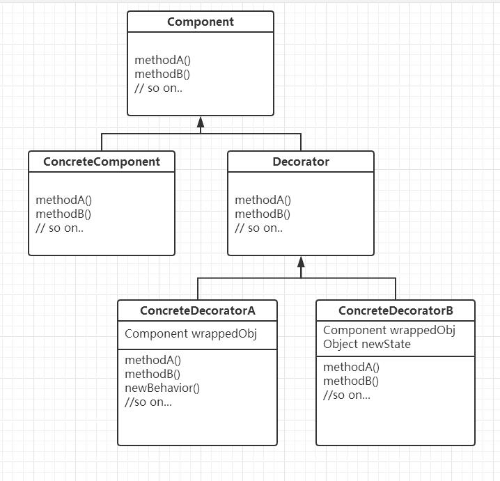

## 第一章

> 策略模式

#### 定义

1. 策略模式定义了算法族，分别封装起来，让它们之间可以相互替换，此模式让算法的变化独立于使用算法的客户
2. 可以将一组行为类定义为算法族，例如下方代码中的`FlyWithWings`就是算法族的一员
3. 实例化对象可以任意选择算法族，在运行时动态改变行为
4. 假设某个行为在不同的子类中不尽相同，那么则应当将该行为抽离为行为类，分开容易变更和不容易变更的代码
5. 不要将行为具体实现在父类或者子类中（针对实现编程），应该考虑能否动态的给子类添加某个行为（针对接口编程），针对接口编程的关键在于多态，在父类的实例变量中定义行为抽象类或接口，子类实例化时动态的选择行为子类（继承了行为抽象类或接口的类）
6. 设计行为抽象类或接口时，应尽可能考虑复用性，不要和某个类强关联
7. 两个类结合起来使用，就是组合（composition），使用组合建立的系统具备很大的弹性

#### 设计原则

1. 找出应用中可能需要变化之处，把它们独立出来，不要和那些不需要变化的代码混在一起
2. 针对接口编程（针对超类编程），而不是针对实现编程。
3. 多用组合，少用继承

#### 示例代码

```java
// 将行为抽离为行为接口，单独定义一个接口是为了可以在Duck类中使用使用多态
interface FlyBehavior {
  public void fly();
}

// 具体行为通过继承行为接口实现，继承行为接口是为了可以使用多态
// 不同的duck可能有不同的飞行行为，所有抽离出来
class FlyWithWings implements FlyBehavior {
  public void fly() {
    System.out.println("I am fly with wings");
  }
}

class Duck {
  // 父类中不需要考虑行为是那个具体事物实现的,由运行时动态决定
  FlyBehavior flyBehavior;

  public void performFly() {
    flyBehavior.fly();
  }

}

class YellowDuck extends Duck {
  YellowDuck(FlyBehavior fb) {
    // 动态设置飞行的行为类，假设以后需要改变为其他飞行类型，也不需要改变类的源码，只需要改变调用方
    flyBehavior = fb;
  }
}

class ChapterOne {
  public static void main(String[] args) {
    Duck yellowDuck = new YellowDuck(new FlyWithWings());
    yellowDuck.performFly();
  }
}
```

---

## 第 2 章

> 观察者模式（注意：在 java9 中，内置的观察者模式已经被废弃 [具体原因](https://bugs.openjdk.java.net/browse/JDK-8154801)）

#### 定义

1. 定义了对象之间的一对多依赖，这样一来，当一个对象改变状态，它的所有依赖者都会收到通知并自动更新
2. 主题（也就是被观察者）用一个共同的接口来更新观察者
3. 观察者和被观察者之间用松耦合方式结合，可观察者不知道观察者的细节，只知道观察者实现了注册更新接口
4. 被观察者可以使用主动推或等待观察者主动拉数据
5. 有多个观察者时，通知的先后顺序不固定

#### 设计原则

为交互对象之间的松耦合设 计而努力

#### 示例代码

```java
import java.util.ArrayList;

/**
 * 被观察者接口
 *
 * 问：为什么要设立被观察者接口？
 * 答：不同的数据源有不同的被观察者，但注册，移除，通知是必要存在的动作，所以抽象一个接口作为规范
 *
 * 问：能不能用抽象类来定义？
 * 答：可以，但是会导致被观察者类无法继承别的超类，限制性大
 */
interface Subject {
  // 组册观察者
  public void registerObserver(Observer o);

  // 移除观察者
  public void removeObserver(Observer o);

  // 通知观察者数据变更
  public void notifyObservers();
}

/**
 * 观察者共同依赖的方法，用于数据变更
 *
 * 问：为什么要定义一个观察者接口？
 * 答：因为要在被观察者类中使用组合，被观察者并不在意具体的观察者是什么，只需要知道他实现了数据更新接口
 */
interface Observer {
  public void update(float temp, float humidity, float pressure);
}

// 继承被观察者接口，被观察者类
class WeatherData implements Subject {
  // 用于记录已组册的观察者
  private ArrayList<Observer> observers = new ArrayList<Observer>();
  private float temperature;
  private float humidity;
  private float pressure;

  // 实现Subject接口
  public void registerObserver(Observer o) {
    observers.add(o);
  }

  // 实现Subject接口
  public void removeObserver(Observer o) {
    int i = observers.indexOf(o);
    if (i >= 0) {
      observers.remove(i);
    }
  }

  // 实现Subject接口
  public void notifyObservers() {
    for (int i = 0; i < observers.size(); i++) {
      Observer observer = (Observer) observers.get(i);
      observer.update(temperature, humidity, pressure);
    }
  }

  public void measurementsChanged() {
    notifyObservers();
  }

  public void setMeasurements(float temperature, float humidity, float pressure) {
    this.temperature = temperature;
    this.humidity = humidity;
    this.pressure = pressure;
    measurementsChanged();
  }
}

// 继承观察者接口
class CurrentConditionsDisplay implements Observer {
  private float temperature;
  private float humidity;
  // 保留该对象是为了可以退出观察者
  private Subject weatherData;

  // 组册成观察者
  CurrentConditionsDisplay(Subject weatherData) {
    this.weatherData = weatherData;
    weatherData.registerObserver(this);
  }

  // 用于被观察者数据变更时自动触发的接口
  public void update(float temperature, float humidity, float pressure) {
    this.temperature = temperature;
    this.humidity = humidity;

    System.out.println("Current conditions: " + temperature + "F degrees and " + humidity + "% humidity");
  }
}

public class ChapterTwo {
  public static void main(String[] args) {
    WeatherData weatherData = new WeatherData();
    CurrentConditionsDisplay currentDisplay = new CurrentConditionsDisplay(weatherData);

    weatherData.setMeasurements(80, 65, 30.4f);
    weatherData.setMeasurements(82, 70, 29.2f);
  }
}
```

---

## 第三章

> 装饰者模式

#### 定义

在不改变原类文件以及不使用继承的情况下，动态地将责任附加到对象上，从而实现动态拓展一个对象的功能。它是通过创建一个包装对象，也就是装饰来包裹真实的对象

#### 设计原则

1. 多用组合，少用继承
2. 开放-关闭原则：类应该对拓展开放，对修改关闭

#### 解读

 

1. `Component`是通常是抽象类或接口，定义了属性和方法，方法一般由子类实现，该类主要用于约束继承树的行为，使得装饰者和被装饰者具有相同的超类型
2. `ConcreteComponent`继承了`Component`，实现了相应的方法，通常作为被装饰者存在
3. `Decorator`也继承了`Component`，可以是抽象类或接口，代表一类装饰者
4. `ConcreteDecorator`继承了`Decorator`，是具体的装饰者，利用组合的特性，每个装饰者内都有一个实例变量保存`Component`的引用，使得`ConcreteDecorator`即有`Component`的属性和方法，又能拓展自己的特性

#### 示例代码

```java
// 装饰者和被装饰者的超类
abstract class Beverage {
  String description = "Unknown Beverage";

  public String getDescription() {
    return description;
  }

  public abstract double cost();
}

// 一类装饰者的抽象类
abstract class CondimentDecorator extends Beverage {
  public abstract String getDescription();
}

// 具体被装饰者
class Espresso extends Beverage {
  public Espresso() {
    description = "Espresso";
  }

  public double cost() {
    return 1.99;
  }
}

// 具体装饰者
class Mocha extends CondimentDecorator {
  // 记录被装饰者
  Beverage beverage;

  public Mocha(Beverage beverage) {
    this.beverage = beverage;
  }

  public String getDescription() {
    return beverage.getDescription() + ", Mocha";
  }

  public double cost() {
    return .20 + beverage.cost();
  }
}

public class ChapterThree {
  public static void main(String[] args) {
    Beverage espresso = new Espresso();

    // 用装饰者包裹被装饰对象
    Beverage mocha = new Mocha(espresso);

    System.out.println(mocha.getDescription() + " " + mocha.cost());
  }
}
```
