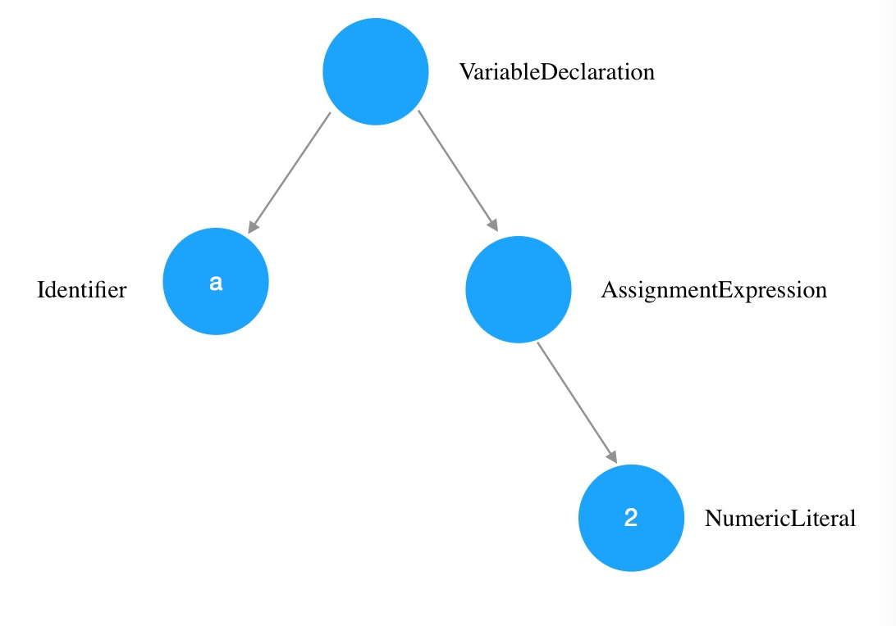

## 第一章 作用域是什么

> 一种用于储存和获取变量的规则

### 编译原理

1. 传统编译语言流程如下
   1. 分词/词法分析
      * 将字符串分解成有意义的代码块，称为词法单元
      * 分词和词法分析主要差异在于词法单元的识别是通过有状态还是无状态的方式进行，例如`a`属于词法单元且同时属于其他词法单元的一部分，调用的是用状态的的解析规则，称为词法分析
      * 例如`var a = 2;`，会被分解为`var` `a` `=` `2` `;`，空格是否作为词法单元取决与在这门语言中时候有意义
   2. 解析/语法分析
      * 将词法单元流（数组）转化为一个由元素逐级潜逃组成的程序语法结构树，称为抽象语法树（abstract syntax tree AST）
      * `var a = 2;`的 AST 如右图
   3. 代码生成
      * 将`var a = 2;`的 AST 转化为机器指令
2. js 属于编译语言，但和传统的不一样，js 不是提前编译的，编译结果也不能运行在分布式系统中
3. js 会在语法分析和代码生成阶段拥有特殊的步骤对对运行性能以及冗余元素进行优化
4. 任何 js 代码运行前都需要编译， 编译需要几微秒（甚至更短）

### 理解作用域

#### 相关介绍

* 引擎：负责整个 js 的编译和执行
* 编译器：负责语法分析和代码生成等
* 作用域：负责收集和维护所有声明的变量组成的一些列查询，并实施一套严格的规则，确定当前代码对这些变量的访问权限

#### 赋值操作

`var a = 2;`，变量的赋值操作一般会执行两个动作

* 编译器在当前作用域新建一个变量（如果之前没有）
* 运行过程中，引擎会在作用域中寻找 a 变量，并赋值为 2，若没有找到则会抛出异常

#### 引擎如何执行查找

* 引擎在查找过程中会执行 LHS 或 RHS 查询，RHS 与简单查找某个变量的值一样，LHS 则是查找值的容器。L 和 R 代表左和右，意味着赋值操作的左边和右边，赋值操作并不单指`=`
* `console.log(a);`，由于`a`没有任何赋值，所以这里执行的是 RHS 查询，查找`a`对应的值
* `var a = 2;`，这里执行 LHS 查询， 需要先找到变量`a`才能用于`= 2`赋值

```javascript
/**
 * 1. c = .. LHS
 * 2. foo(2) RHS
 * 3. foo(a) -> a = 2 LHS
 * 4. b = a，对b进行LHS，对a进行RHS
 * 4. a + b，对a进行RHS，对b进行RHS
 */

function foo(a) {
  var b = a;
  return a + b;
}
var c = foo(2);
```

#### 作用域嵌套

当一个块或函数嵌套在另外一个块或函数中，就触发作用域嵌套，在当前作用域无法找到某个变量时，引擎会在嵌套的外层作用域继续寻找，直到全局作用域，而后无论是否找到，整个过程都会终止

#### 异常

* 找不到变量时,LHS 会在全局作用域创建一个变量（严格模式下会抛出 ReferenceError）
* 找不到变量时,RHS 则会抛出 ReferenceError 异常
* 如果 RHS 查询找到了一个变量，但是你尝试对这个变量的值进行不合理的操作， 比如试图对一个非函数类型的值进行函数调用，或者引用`null`或`undefined`类型的值中的属性，那么引擎会抛出另外一种类型的异常，叫作 TypeError
* ReferenceError 同作用域判别失败相关，而 TypeError 则代表作用域判别成功了，但是对结果的操作是非法或不合理的。

---

## 第二章 词法作用域

### 定义

词法作用域就是定义在词法阶段的作用域，词法作用域是由你在写代码时将变量和块作用域写在哪里来决定的，因此当词法分析器处理代码时会保持作用域不变(大部分情况下是这样的)。没有任何作用域能同时出现在两个外部作用域中。


* 1 包含着整个全局作用域，其中只有一个标识符:foo。
* 2 包含着 foo 所创建的作用域，其中有三个标识符:a、bar 和 b。
* 3 包含着 bar 所创建的作用域，其中只有一个标识符:c。

### 查找

* 作用域气泡的结构和互相之间的位置关系给引擎提供了足够的位置信息，引擎用这些信息来查找标识符的位置。
* 作用域查找会在找到第一个匹配的标识符时停止。在多层的嵌套作用域中可以定义同名的标识符，内部的标识符会遮蔽外部的标识符。
* 词法作用域查找只会查找一级标识符，比如 a、b 和 c。如果代码中引用了 foo.bar.baz，词法作用域查找只会试图查找 foo，找到后，对象属性访问规则会分别接管对 bar 和 baz 属性的访问

### 欺骗词法

```javascript
function foo(str, a) {
  // 引擎会认为由eval动态插入的代码书写时就在这
  eval(str);
  console.log(a, b); // 1, 3
}
var b = 2;
foo('var b = 3;', 1);
```

```javascript
function foo(obj) {
  // 实际上c不会存在于with的作用域内，而是会在foo内
  with (obj) {
    var c = 1;
    a = 2;
  }
}
var o1 = {
  a: 3,
};
var o2 = {
  b: 3,
};
foo(o1);
foo(o2);

// 将 o1 传递进去，a = 2 赋值操作找到了 o1.a 并将 2 赋值给它
console.log(o1.a);

// o2 传递进去，o2 并没有 a 属性，因此不会被创建，所以log出undefined
console.log(o2.a);

// a = 2 执行了 LHS 查询，在内部作用域到顶层作用域都找不到这个值，所以会在全局作用域新建
console.log(a);
```

* `eval`和`with`会在运行时修改或创建新的作用域，以此来欺骗其他在书写时定义的词法作用域。
* 引擎会在编译阶段进行数项的性能优化。其中有些优化依赖于能够根据代码的词法进行静态分析，并预先确定所有变量和函数的定义位置，才能在执行过程中快速找到标识符。
* 如果代码中存在`eval`或`with`，引擎只能谨慎地认为这样的优化是无效的。使用这其中任何一个机制都将导致代码运行变慢
