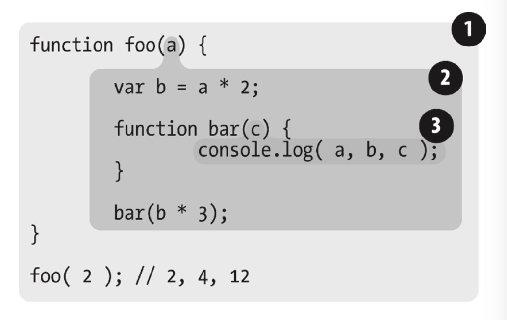

> 所有示例代码都需在浏览器环境下测试，直接使用 nodejs 运行可能会导致结果有所偏差

# 作用域和闭包

## 第一章 作用域是什么

> 一种用于储存和获取变量的规则

### 编译原理

1. 传统编译语言流程如下
   1. 分词/词法分析
      * 将字符串分解成有意义的代码块，称为词法单元
      * 分词和词法分析主要差异在于词法单元的识别是通过有状态还是无状态的方式进行，例如`a`属于词法单元且同时属于其他词法单元的一部分，调用的是用状态的的解析规则，称为词法分析
      * 例如`var a = 2;`，会被分解为`var` `a` `=` `2` `;`，空格是否作为词法单元取决与在这门语言中时候有意义
   2. 解析/语法分析
      * 将词法单元流（数组）转化为一个由元素逐级潜逃组成的程序语法结构树，称为抽象语法树（abstract syntax tree AST）
      * `var a = 2;`的 AST 如右图
   3. 代码生成
      * 将`var a = 2;`的 AST 转化为机器指令
2. js 属于编译语言，但和传统的不一样，js 不是提前编译的，编译结果也不能运行在分布式系统中
3. js 会在语法分析和代码生成阶段拥有特殊的步骤对对运行性能以及冗余元素进行优化
4. 任何 js 代码运行前都需要编译， 编译需要几微秒（甚至更短）

### 理解作用域

#### 相关介绍

* 引擎：负责整个 js 的编译和执行
* 编译器：负责语法分析和代码生成等
* 作用域：负责收集和维护所有声明的变量组成的一些列查询，并实施一套严格的规则，确定当前代码对这些变量的访问权限

#### 赋值操作

`var a = 2;`，变量的赋值操作一般会执行两个动作

* 编译器在当前作用域新建一个变量（如果之前没有）
* 运行过程中，引擎会在作用域中寻找 a 变量，并赋值为 2，若没有找到则会抛出异常

#### 引擎如何执行查找

* 引擎在查找过程中会执行 LHS 或 RHS 查询，RHS 与简单查找某个变量的值一样，LHS 则是查找值的容器。L 和 R 代表左和右，意味着赋值操作的左边和右边，赋值操作并不单指`=`
* `console.log(a);`，由于`a`没有任何赋值，所以这里执行的是 RHS 查询，查找`a`对应的值
* `var a = 2;`，这里执行 LHS 查询， 需要先找到变量`a`才能用于`= 2`赋值

```javascript
/**
 * 1. c = .. LHS
 * 2. foo(2) RHS
 * 3. foo(a) -> a = 2 LHS
 * 4. b = a，对b进行LHS，对a进行RHS
 * 4. a + b，对a进行RHS，对b进行RHS
 */

function foo(a) {
  var b = a;
  return a + b;
}
var c = foo(2);
```

#### 作用域嵌套

当一个块或函数嵌套在另外一个块或函数中，就触发作用域嵌套，在当前作用域无法找到某个变量时，引擎会在嵌套的外层作用域继续寻找，直到全局作用域，而后无论是否找到，整个过程都会终止

#### 异常

* 找不到变量时,LHS 会在全局作用域创建一个变量（严格模式下会抛出 ReferenceError）
* 找不到变量时,RHS 则会抛出 ReferenceError 异常
* 如果 RHS 查询找到了一个变量，但是你尝试对这个变量的值进行不合理的操作， 比如试图对一个非函数类型的值进行函数调用，或者引用`null`或`undefined`类型的值中的属性，那么引擎会抛出另外一种类型的异常，叫作 TypeError
* ReferenceError 同作用域判别失败相关，而 TypeError 则代表作用域判别成功了，但是对结果的操作是非法或不合理的。

---

## 第二章 词法作用域

### 定义

词法作用域就是定义在词法阶段的作用域，词法作用域是由你在写代码时将变量和块作用域写在哪里来决定的，因此当词法分析器处理代码时会保持作用域不变(大部分情况下是这样的)。没有任何作用域能同时出现在两个外部作用域中。



* 1 包含着整个全局作用域，其中只有一个标识符:foo。
* 2 包含着 foo 所创建的作用域，其中有三个标识符:a、bar 和 b。
* 3 包含着 bar 所创建的作用域，其中只有一个标识符:c。

### 查找

* 作用域气泡的结构和互相之间的位置关系给引擎提供了足够的位置信息，引擎用这些信息来查找标识符的位置。
* 作用域查找会在找到第一个匹配的标识符时停止。在多层的嵌套作用域中可以定义同名的标识符，内部的标识符会遮蔽外部的标识符。
* 词法作用域查找只会查找一级标识符，比如 a、b 和 c。如果代码中引用了 foo.bar.baz，词法作用域查找只会试图查找 foo，找到后，对象属性访问规则会分别接管对 bar 和 baz 属性的访问

### 欺骗词法

```javascript
function foo(str, a) {
  // 引擎会认为由eval动态插入的代码书写时就在这
  eval(str);
  console.log(a, b); // 1, 3
}
var b = 2;
foo('var b = 3;', 1);
```

```javascript
function foo(obj) {
  // 实际上c不会存在于with的作用域内，而是会在foo内
  with (obj) {
    var c = 1;
    a = 2;
  }
}
var o1 = {
  a: 3,
};
var o2 = {
  b: 3,
};
foo(o1);
foo(o2);

// 将 o1 传递进去，a = 2 赋值操作找到了 o1.a 并将 2 赋值给它
console.log(o1.a);

// o2 传递进去，o2 并没有 a 属性，因此不会被创建，所以log出undefined
console.log(o2.a);

// a = 2 执行了 LHS 查询，在内部作用域到顶层作用域都找不到这个值，所以会在全局作用域新建
console.log(a);
```

* `eval`和`with`会在运行时修改或创建新的作用域，以此来欺骗其他在书写时定义的词法作用域。
* 引擎会在编译阶段进行数项的性能优化。其中有些优化依赖于能够根据代码的词法进行静态分析，并预先确定所有变量和函数的定义位置，才能在执行过程中快速找到标识符。
* 如果代码中存在`eval`或`with`，引擎只能谨慎地认为这样的优化是无效的。使用这其中任何一个机制都将导致代码运行变慢

---

## 第三章 函数作用域和块作用域

### 函数作用域

#### 含义

属于这个函数的全部变量都能在整个函数的范围或嵌套函数内使用以及复用。无法从外部作用域访问函数作用域内的变量

#### 隐藏内部实现

* 可以用一个函数将一段代码包装起来，从而将里面的变量和函数等从外部作用域中隐藏起来。这种做法称为最小特权（最小授权或最小暴露原则），这个原则是指在软件设计中，应该最小限度地暴露必要内容，而将其他内容都“隐藏”起来，比如某个模块或对象的 API 设计。
* 可以避免变量或函数名冲突
* 通常第三方库会在全局全局作用域使用一个变量，例如`var myLib = {};`，`myLib`被称为命名空间，第三方库会隐藏自身的变量而将命名空间暴露给全局作用域，
* 规避冲突的另外一种方式是使用模块管理`import export`等，在需要的地方显示的引入特定作用域中，而不需要污染全局作用域

#### 函数表达式

将代码用函数包裹起来固然可以隐藏一些东西，但至少函数名会污染外部作用域。函数有两个，函数声明和函数表达式，`function`不是出现在整个声明代码的第一位置就是函数表达式，反之则为函数声明

```javascript
// 函数声明，test会暴露在外部作用域中
function test() {}

// 函数表达式，test只会存在于...的作用域中
var a = function test { ... }

// 我也是函数表达式
settimeout(function() {}, 0);

// 立即执行函数(IIFE)，也是函数表达式的一种，主要有两种用于
// 1. 自动执行 2. 颠倒代码运行的顺序，将需要运行的函数放在第二位，在 IIFE 执行之后当作参数传递进去
(function(global) ())(window)
```

函数表达式可以匿名也可具名，好的实践应该为所有函数表达式添加名称

* 匿名函数在栈追踪中不会显示出有意义的函数名，使得调试很困难。
* 没有函数名，很难在递归调用中使用自己。
* 匿名函数省略了对于代码可读性/可理解性很重要的函数名。

### 块作用域

在 es5 中，javascript 的块级作用域不清晰，很难实现你想要的样子

```javascript
var bar = true;
if (bar) {
  var a = 1;
}
```

如上代码，我们希望将`a`封死在`{}`块级作用域中，表面上看起来是这样，然而实际`var`存在变量提升问题（这里不详细谈论这个问题），无论在哪声明，都会出现在外部作用域中，es5 中能实现块级作用域的只有`with` `try()catch(err){// err变量只在这里有效}`

```javascript
var bar = true;
if (bar) {
  {
    const b = 1;
    let a = 1;
  }
}
```

如上代码，在 es6 中，可以定义`let`以及显示的块级作用域`{}`，以`let`声明的变量就不会存在于外部作用域中，只在当前块级作用域。`const`也可以用来定义块级作用域，但`const`的内容一经声明，不可以再改变。块级作用域的变量会在使用过后被垃圾回收

---

## 第四章 提升

* `var a = 2;`实际上是两个声明，`var a`会在编译阶段进行，`a = 2`会等待执行阶段。将声明移动到自身顶层作用域的过程就称为提升
* 声明本身会被提升，而包括函数表达式的赋值在内的赋值操作并不会提升。

```javascript
console.log(a); // undefined
var a = 2;

// 上面的代码实际如下

var a;
console.log(a); // undefined
a = 2;
```

```javascript
foo(); // 1

function foo() {
  conosole.log(1);
}

// 由于函数声明也会被提升，所以上面的代码实际如下

function foo() {
  console.log(1);
}

foo(); // 1
```

```javascript
foo(); // typeError

var foo = function() {
  console.log(1);
};

// 由于函数表达式function本身不会被提升，所以上面的代码实际如下

var foo;

foo(); // 对非函数变量使用函数()操作，所以会报typeError

foo = function() {
  console.log(1);
};
```

```javascript
// 由于存在函数声明优先的机制，无论var foo在哪定义，funtion foo都会优先不会被覆盖
foo(); // 1

function foo() {
  console.log(1);
}

var foo = function() {
  console.log(2);
};
```

---

## 第五章 作用域闭包

### 定义

当函数可以记住并访问所在的词法作用域，且函数是在当前词法作用域之外执行的，就产生了闭包，可以理解为闭包就是对该函数的引用

```javascript
function foo() {
  var a = 1;

  function bar() {
    console.log(1);
  }

  bar();
}
```

* 上述代码`bar`能记住并访问`foo`作用域的变量，但`bar`并没有在当前词法作用域外运行，所以准确来说并没有完全形成闭包，`bar`对`a`的引用是词法作用域的 RHS 引用查询，查询规则也属于闭包的一部分

```javascript
function foo() {
  var a = 2;

  function bar() {
    console.log(a);
  }

  return bar;
}

var baz = foo(); // 这里形成了闭包
baz(); // 2
```

* 上述代码中，可能有人会期待`foo`执行完毕之后，内部作用域会被垃圾回收。但事实上并不会，`bar`能访问并记住了`foo`作用域的变量，且在外部作用域中被调用，所以`var baz = foo();`处形成了闭包，闭包并不会被垃圾回收

```javascript
function foo() {
  var a = 2;
  function baz() {
    console.log(a); // 2
  }
  bar(baz);
}

function bar(fn) {
  fn(); // 实际上为baz()，这里形成了闭包
}
```

* 上述代码，`baz`能够访问并记住`foo`作用域内的变量，且在外部作用域被引用，所以我们可以认为`baz()`形成了闭包

```javascript
var fn;
function foo() {
  var a = 2;
  function baz() {
    console.log(a);
  }

  fn = baz;
}

function bar() {
  fn(); // 实际上为baz()，这里形成了闭包
}

foo();
bar(); // 2
```

* 上述代码，`baz`能够访问并记住`foo`作用域内的变量，且在外部作用域被引用，所以我们可以认为`baz()`形成了闭包

```javascript
function wait(message) {
  setTimeout(function timer() {
    console.log(message);
  }, 1000);
}
wait('Hello, closure!');
```

* 上述代码中，`timer`能记住并访问`wait`作用域的变量，且在`setTimeout`函数中，必定有个`fn`会持有`timer`作用域的引用，也就是形成了闭包。基于此，我们认为只要使用了回掉函数，就等同于使用了闭包

```javascript
var a = 2;

(function IIFE() {
  console.log(a);
})();
```

* 上述代码使用了立即执行函数 ITFE，严格来说，并没有形成闭包，因为没有在别的作用域中被调用。但这里确实也使用了闭包，算是一个特别的存在

### 循环与闭包

```javascript
for (var i = 1; i <= 5; i++) {
  setTimeout(function timer() {
    console.log(i);
  }, i * 1000);
}
```

* 由于`i`被当前作用域和其嵌套的作用域共享，而`setTimeout`延迟执行函数会在循环结束之后才运行，所以上述代码会输出 5 个 6，1 秒 1 个

```javascript
for (var i = 1; i <= 5; i++) {
  (function(j) {
    setTimeout(function timer() {
      console.log(j);
    }, j * 1000);
  })(i);
}
```

* 上述代码中，每次迭代时立即执行函数都会形成新的作用域，每个作用域存在独立的`j`，所以输出结果是 1,2,3,4,5

```javascript
for (let i = 1; i <= 5; i++) {
  setTimeout(function timer() {
    console.log(i);
  }, i * 1000);
}
```

* 上述代码使用了 es6 的语法`let`，每次迭代都形成了隐藏的作用域，各自保存`i`，所以输出结果是 1,2,3,4,5

### 模块

* 模块模式用于对外暴露公共 api，形成模块需要具备两个条件
  1. 必须有外部的封闭函数，该函数至少被调用一次
  2. 封闭函数至少返回一个内部函数，这样才能在形成闭包

```javascript
var foo = (function CoolModule() {
  var something = 'cool';
  function doSomething() {
    console.log(something);
  }
  return {
    doSomething: doSomething,
  };
})();
foo.doSomething(); // cool
```

* `CoolModule`是封闭函数且被调用，内部返回了`doSomething`函数的引用，所以可以认为`CoolModule`是个模块，而`foo`接受了一个模块实例

```javascript
var MyModules = (function Manager() {
  var modules = {};
  function define(name, deps, impl) {
    for (var i = 0; i < deps.length; i++) {
      deps[i] = modules[deps[i]];
    }
    modules[name] = impl.apply(impl, deps);
  }
  function get(name) {
    return modules[name];
  }
  return {
    define: define,
    get: get,
  };
})();

// 定义模块的例子如下

MyModules.define('bar', [], function() {
  function hello(who) {
    return 'Let me introduce: ' + who;
  }
  return {
    hello: hello,
  };
});
//['bar']表示需要使用bar模块的方法
MyModules.define('foo', ['bar'], function(bar) {
  function awesome() {
    console.log(bar.hello('hippo'));
  }
  return {
    awesome: awesome,
  };
});
```

* 上述代码是生成模块的公共方法，主要有两个核心点
  1. `deps[i] = modules[deps[i]]`，根据`deps[i]`找到`modules`中保存的某个模块回掉函数的引用（闭包），并赋值到`deps[i]`中，这样做是为了不同模块可以相互调用各自暴露的方法
  2. `modules[name] = impl.apply(impl, deps)`，将回掉函数的引用（闭包）保存到`modules`

```javascript
// bar.js
function hello(who) {
return "Let me introduce: " + who;
}
export hello;

// foo.js
// 仅从 "bar" 模块导入 hello()
import hello from "bar";
var hungry = "hippo";
function awesome() {
  console.log(hello(hungry).toUpperCase());
}
export awesome;

// baz.js
module foo from "foo";
foo.awesome();
```

* 上述代码中，`import` `export` `module` 都是 es6 的语法，和传统的模块不同，es6 中 1 个模块 1 个文件，通过`import`导入，`export`导出。`module`是导入整个模块，可以任意使用内部函数

---

# this 和对象原型

## 第五章 关于 this

```javascript
function identify() {
  return this.name;
}

function speak() {
  console.log('Hello I am ' + identify.call(this));
}

var me = { name: 'haha' };
var you = { name: 'hehe' };

speak.call(me); // Hello I am haha
speak.call(you); // Hello I am hehe
```

* 如上所示，this 提供一种更优雅的方式来传递一个对象引用，因此可以将代码 api 设计得更加简洁通用

#### this 并不指向函数自身

```javascript
function foo() {
  this.count++;
}

foo.count = 0;

foo();

console.log(foo.count); // 0
```

* 如上所示，因为 `this` 并不是指向 `foo`，所以`this.count++`并没有使得`foo.count`有任何变化

#### this 并不指向作用域

```javascript
function foo() {
  var a = 2;
  this.bar();
}
function bar() {
  console.log(this.a);
}
foo(); // ReferenceError: a is not defined
```

* 词法作用域在编译阶段已经定义好，一般是不能在执行阶段有所改变的，所以上述代码试图以`this`来沟通`foo`和`bar`之间的作用域，显然是不会成功的

#### this 是什么

* this 是在运行时候被绑定的，并不是在编译阶段。所以 this 的绑定和函数声明的位置没有任何关系，只取决于函数的调用方式
* 当一个函数被调用时，会创建一个活动记录（也可称之为上下文），该记录包括函数在哪里被调用以及调用方式等，this 就是该记录的其中一个属性

---

## 第六章 this 全面解析

### 调用位置

* 调用位置就是函数在代码中被调用的位置，而不是声明的位置
* 调用栈是为了到达目前所执行的位置所调用的全部函数，调用位置就在正在执行的函数的前一个调用中

```javascript
function baz {
  bar();
}

function bar() {
  foo();
}

function foo {
  consol.log('I am foo');
}

baz();
```

* 如上代码所示，`bar`的调用栈是 baz -> bar，所以`bar`调用位置在`baz`中，`foo`的调用栈为 baz -> bar -> foo，所以`foo`的调用位置在`bar`
* 手动分析在实际代码场景中容易出错，可以使用 chrome 来进行调试，获取当前断点位置的函数调用列表

### 绑定规则

#### 默认绑定

```javascript
function bar() {
  console.log(this.a);
}

var a = 2;

bar(); // 2
```

* 如上代码所示，`bar()`为直接调用，不带任何修饰，这种情况就称为默认绑定，默认绑定下 this 指向调用位置所在的作用域，所以上述代码的 this 指向全局作用域

```javascript
function foo() {
  'use strict';

  console.log(this.a);
}

var a = 2;

foo(); // TypeError: this is undefined
```

* 如上代码所示，使用严格模式`'use strict'`时，this 无法通过默认绑定的方式绑定到全局作用域

```javascript
function foo() {
  console.log(this.a);
}

var a = 2;

(function() {
  'use strict';

  foo(); // 2
})();
```

* 如上代码所示，在函数声明的位置使用严格模式才能影响默认绑定，在调用位置声明不会用任何影响。在真实代码场景中，不应该分别定义严格模式，要么全局定义，要么不使用

<div style="height: 1px;background-color: #c8c8c8;width: 100%"></div>

#### 隐式绑定

```javascript
function foo() {
  console.log(this.a);
}

var obj = {
  a: 2,
  foo: foo,
};

var obj1 = {
  a: 3,
  obj: obj,
};

obj.foo(); // 2

obj1.obj.foo(); // 2
```

* 如上述代码，当函数引用有上下文对象的时候，函数的 this 会绑定到该上下文对象中，该规则称为隐式绑定。值得注意的一点是，this 只会绑定在引用对象链的最后一项

_隐性丢失_

```javascript
function foo() {
  console.log(this.a);
}
var obj = {
  a: 2,
  foo: foo,
};
var bar = obj.foo;
var a = 'oops, global';

bar(); // oops, global
```

* 如上诉代码，`bar`实际绑定的是`foo`函数的引用，所以等于直接调用`foo()`，并没有上下文对象的引用，所以这里会引用默认绑定

```javascript
function foo() {
  console.log(this.a);
}
function doFoo(fn) {
  fn(); // 函数调用位置
}
var obj = {
  a: 2,
  foo: foo,
};
var a = 'oops, global';

doFoo(obj.foo); // oops, global
```

* 上述代码同样没有在调用位置直接上下文对象来引用，所以实际上还是使用了默认绑定

<div style="height: 1px;background-color: #c8c8c8;width: 100%"></div>

#### 显示绑定

一般使用`.call()` `.apply()` `.bind()` 来强制定义 this 的指向，但依旧无法避免隐性丢失问题

```javascript
function foo() {
  console.log(this.a);
}
function doFoo(fn) {
  fn(); // 函数调用位置
}
var obj = {
  a: 2,
  foo: foo,
};
var a = 'oops, global';

doFoo.call(obj, obj.foo); // oops, global
```

* 如上代码，虽然强制 `doFoo` 的 `this` 指向 `obj`，但由于调用位置函数还是没有对象的上下文，所以实际依旧为默认绑定

硬绑定

```javascript
function foo() {
  console.log(this.a);
}

var obj = {
  a: 2,
  foo: foo,
};

foo.call(obj);
```

* 通过`call`等函数将上下文对象绑定都函数调用位置即为硬绑定，如上代码所示，`foo.call(obj)`使得代码执行时`this`永远指`obj`，不可变更

api 调用的“上下文”

```javascript
[1].forEach(
  function(el) {
    console.log(el, this.id); // 1 awesome
  },
  {
    id: 'awesome',
  },
);
```

* 如上代码所示，javascript 或者很多第三方库的内置函数都会提供一个可选的参数，用来传递上下文对象，确保回掉函数的`this`指向该对象

<div style="height: 1px;background-color: #c8c8c8;width: 100%"></div>

#### new 绑定

* 与传统的面向对象语言不同，javascript 中`new`并不会实例化某个类，所有的函数都可以被`new`调用，称为构造函数调用。构造函数调用过程会有 4 个步骤
  1. 创建（构造）一个全新的对象
  2. 这个对象会被执行[[Prototype]]链接（后续章节会解释）
  3. 该对象会被绑定到被调用的函数的`this`上
  4. 如果函数没有指定返回，会默认返回第 1 步中创建的对象

```javascript
function foo(a) {
  this.a = a;
}
var bar = new foo(2);
console.log(bar.a); // 2
```

* 如上代码所示，`new foo(2)`会创建一个新的对象并将该对象绑定到`foo`的`this`上，由于`foo`没有指定返回，所以`bar`默认接收了新建对象的引用，故而`bar.a`输出 2

### 优先级

毫无疑问，默认绑定优先级是最低了，所以不做对比，主要对比隐式绑定、显示绑定和 new 绑定

```javascript
function foo() {
  console.log(this.a);
}
var obj = {
  a: 2,
  foo: foo,
};
var obj2 = {
  a: 3,
  foo: foo,
};

obj.foo.call(obj2); // 3
```

* 如上代码所示，隐性绑定 < 显性绑定

```javascript
function foo(something) {
  this.a = something;
}
var obj1 = {
  foo: foo,
  a: 2,
};

var bar = new obj1.foo(4);

console.log(obj1.a); // 2
console.log(bar.a); // 4
```

* 如上代码所示，new 绑定 > 隐形绑定。（注意：`new`会生成新的对象并且`this`指向该对象，所以并不会改变`obj1`原有的值）

```javascript
function foo(something) {
  this.a = something;
}
var obj1 = {};
var bar = foo.bind(obj1);
bar(2);
console.log(obj1.a); // 2

var baz = new bar(3);
console.log(baz.a); // 3

bar(5);
console.log(obj1.a); // 5
```

* 如上代码所示
  * `new`并不能同时和`call`或`apply`使用，无法很好的比对优先级
  * 除了`bind`，`call` `apply` 都不会生成新的函数，所以使用`bind`来生成硬绑定过的函数
  * `new`会生成新的对象`baz`，并不会影响原来的`bar`以及`obj1`，也就是说`new`和`bind`之间相互独立，互不影响

### 绑定的例外

某些场景下，`this`绑定规则会失效，重新使用默认绑定方式

#### null 或 undefined 作为 this 对象

```javascript
var b;
function foo() {
  this.b = 100;
}

foo.call(null);

console.log(b); // 100
console.log(foo.b); // undefined

// DMZ
b = undefined;
var ø = Object.create(null);
foo.call(ø);

console.log(b); // undefined
```

* 如上述代码所示，当企图使用 null 或 undefined 做硬绑定时，实际上程序会使用默认绑定，所以`this`被绑定到全局作用域。假如函数内部存在`this`，那么上述代码就会存在风险问题，容易修改了全局对象
* 更安全的做法是建立一个空对象(DMZ)，再将`this`绑定到该对象上

#### 间接引用

```javascript
function foo() {
  console.log(this.a);
}
var a = 2;
var o = { a: 3, foo: foo };
var p = { a: 4 };

o.foo(); // 3
(p.foo = o.foo)(); // 2
```

* 如上述代码所示，`p.foo`实际上指向了`foo`，所以`(p.foo = o.foo)();`会使用默认绑定，属于隐形绑定丢失的一种情况

#### 箭头函数

箭头函数是 es6 中新出的语法，该函数不遵循上述绑定规则，`this`继承外层作用域的`this`

```javascript
function foo() {
  return a => {
    console.log(this.a);
  };
}
var obj1 = { a: 2 };
var obj2 = { a: 3 };
var bar = foo.call(obj1);

bar.call(obj2); // 2,
```

* 如上述代码所示，`=>`代表箭头函数，箭头函数的`this`和`foo`的`this`一致，所以该箭头函数的`this`指向`obj1`对象

---

## 第七章 对象

### 语法

```javascript
// 文字语法
var myObj = { key: 'value' };

// 构造函数形式
var myObj = new Object();
myObj.key = 'value';
```

* 如上述代码所示，对象可以通过文字语法或构造函数形式创建，社区中绝大多数使用文字语法

### 类型

* javascript 一共有 6 种语言类型，string、number、boolean、null、undefined、object
* 除了 object 之外，其他类型都不属于对象，虽然`typeof null == 'object'`，但这只是语言的 bug，实际上 null 是基本类型
  * 所有类型在底层都以二进制表示，null 的二进制全是 0，而 js 认为前 3 位的 0 的二进制就是对象
* 函数比较特别，虽然本质上和对象一样（能够被调用），但如果对函数进行`typeof`会返回`function`。有一种理解是因为函数是 js 的一等公民

#### 内置对象

* javascript 中还有一些对象的子类型，称为内置对象，部分内置对象看起来和基本类型命名一直，但其实并不相等
  * String、Number、Boolean、Object、Function、Array、Date、RegExp、Error
* 内置对象实际上是可以当作构造函数的内置函数

```javascript
var strObj = new String('123');
var str = '123';
console.log(str.length); // 3
console.log(typeof strObj); // object
console.log(strObj instanceof Object); // true
console.log(typeof str); // string
console.log(str instanceof Object); // false
```

* 上述代码中，`strObj`是构造调用生成的对象，而`str`不属于对象，只是通过文字语法形式生成的字面量，字面量也可以像对象一样访问属性和方法，程序会自动转化，并不需要手动转
* String、Number、Boolean 通过语法形式生成的就是字面量，通过构造调用生成的就是对象
* Object、Function、Array、RegExp 两种方式生成的都是对象
* Date 只能构造调用
* Error 很少使用，抛出异常时会自动创建，也可以手动构造调用

### 内容

...
