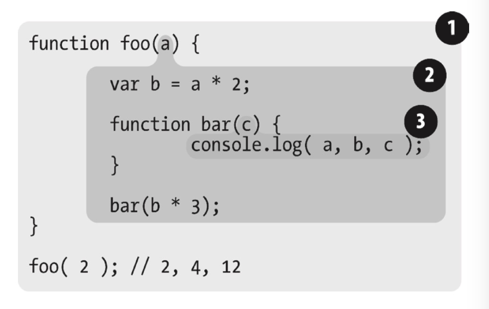
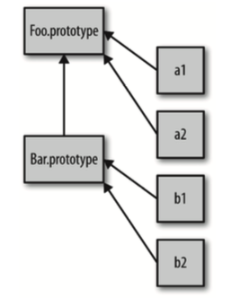
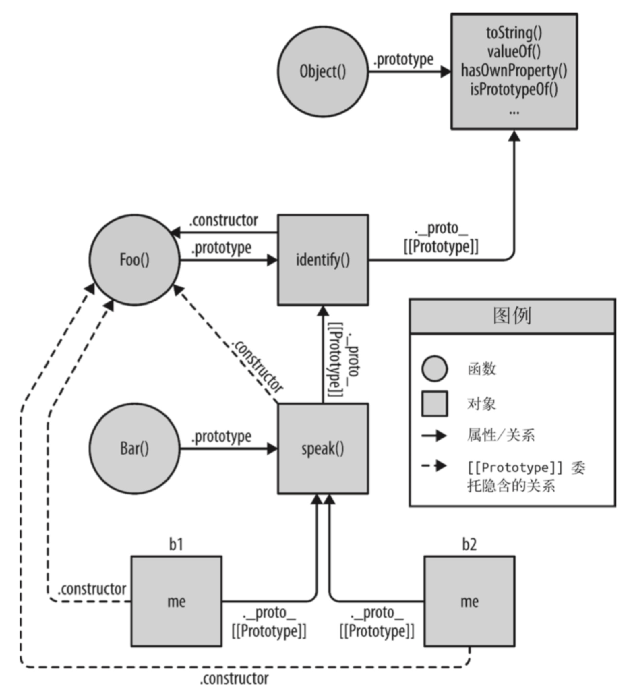
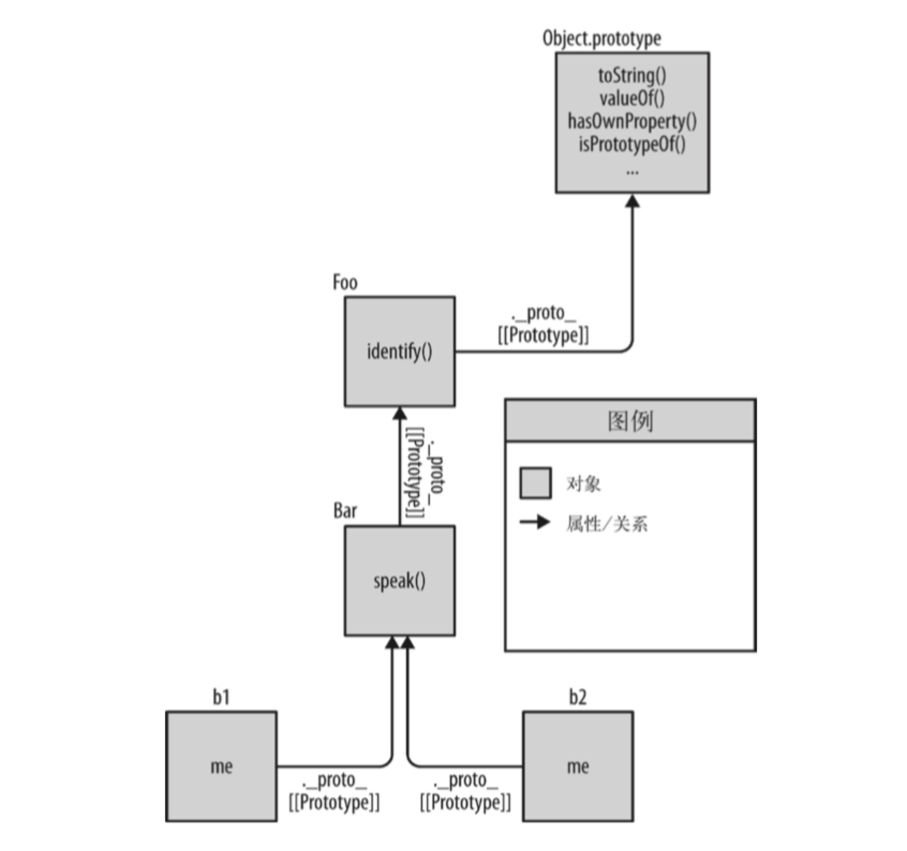

> 所有示例代码都需在浏览器环境下测试，直接使用 nodejs 运行可能会导致结果有所偏差

# 作用域和闭包

## 第一章 作用域是什么

### 编译过程

JavaScript 属于编译语言，编译过程主要经历三个步骤

1. 分词/词法分析，例如将`var a = 2;`分解为有意义的代码块
2. 解析/语法分析，将代码块转化为由元素嵌套组成的结构树，称为抽象语法树
3. 代码生成，将抽象语法树转为可执行的代码

传统编译语言多数为构建前编译（例如 java），而 JavaScript 是在执行前编译，大多数编译情况都发生在代码执行前几毫秒内

### 理解作用域

作用域是一套规则，用于确定在何处以及如何查找变量（标识符），如果查找的目的是对变量进行赋值，那就会使用 LHS 查询；如果查询的目的是获取变量的值，则使用 RHS 查询。  
一般一个块或者函数表示一个作用域，两个作用域可能会发生嵌套

**什么是作用域嵌套**

如果一个函数内存在另外一个函数，就会发生作用域嵌套，查询规则会逐级往上，直至找到或到达顶层作用域（浏览器环境顶层作用域应该是 window）

```javascript
// a和b之间发生了作用域嵌套
function a() {
  var a = 1;

  function b() {
    var b = 2;
    return a + b;
  }
}
```

**什么是 LHS、RHS 查询**

LHS 为左查询，一般出现在赋值操作的左端，表示要找到某个容器，例如`var a = 1`，这里`a`会进行左查询，作用域会返回相应的容器，如果当前作用域无法找到，则逐级往上，直达顶层作用域（浏览器环境应该是 window），如果顶层作用域也无法找到，非严格模式下会自动在顶层作用域创建一个变量，严格模式下会抛出`ReferenceError`  
RHS 为右查询，一般出现在赋值操作的右端，表示要找到某个值，例如`var a = b`，这里`b`会进行右边查询，作用域会返回相应的值，同样会逐级往上查询，顶层作用域无法找到则抛出`ReferenceError`

---

## 第二章 词法作用域

### 定义

词法作用域就是定义在词法阶段的作用域，词法作用域是由你在写代码时将变量和块作用域写在哪里来决定的，因此当词法分析器处理代码时会保持作用域不变(大部分情况下是这样的)。没有任何作用域能同时出现在两个外部作用域中。



- 1 包含着整个全局作用域，其中只有一个标识符:foo。
- 2 包含着 foo 所创建的作用域，其中有三个标识符:a、bar 和 b。
- 3 包含着 bar 所创建的作用域，其中只有一个标识符:c。

### 查找

- 作用域气泡的结构和互相之间的位置关系给引擎提供了足够的位置信息，引擎用这些信息来查找标识符的位置。
- 作用域查找会在找到第一个匹配的标识符时停止。在多层的嵌套作用域中可以定义同名的标识符，内部的标识符会遮蔽外部的标识符。
- 词法作用域查找只会查找一级标识符，比如 a、b 和 c。如果代码中引用了 foo.bar.baz，词法作用域查找只会试图查找 foo，找到后，对象属性访问规则会分别接管对 bar 和 baz 属性的访问

### 欺骗词法

```javascript
function foo(str, a) {
  // 引擎会认为由eval动态插入的代码书写时就在这
  eval(str);
  console.log(a, b); // 1, 3
}
var b = 2;
foo("var b = 3;", 1);
```

```javascript
function foo(obj) {
  // 实际上c不会存在于with的作用域内，而是会在foo内
  with (obj) {
    var c = 1;
    a = 2;
  }
}
var o1 = {
  a: 3
};
var o2 = {
  b: 3
};
foo(o1);
foo(o2);

// 将 o1 传递进去，a = 2 赋值操作找到了 o1.a 并将 2 赋值给它
console.log(o1.a);

// o2 传递进去，o2 并没有 a 属性，因此不会被创建，所以log出undefined
console.log(o2.a);

// a = 2 执行了 LHS 查询，在内部作用域到顶层作用域都找不到这个值，所以会在全局作用域新建
console.log(a);
```

- `eval`和`with`会在运行时修改或创建新的作用域，以此来欺骗其他在书写时定义的词法作用域。
- 引擎会在编译阶段进行数项的性能优化。其中有些优化依赖于能够根据代码的词法进行静态分析，并预先确定所有变量和函数的定义位置，才能在执行过程中快速找到标识符。
- 如果代码中存在`eval`或`with`，引擎只能谨慎地认为这样的优化是无效的。使用这其中任何一个机制都将导致代码运行变慢

---

## 第三章 函数作用域和块作用域

### 函数作用域

#### 含义

属于这个函数的全部变量都能在整个函数的范围或嵌套函数内使用以及复用。无法从外部作用域访问函数作用域内的变量

#### 隐藏内部实现

- 可以用一个函数将一段代码包装起来，从而将里面的变量和函数等从外部作用域中隐藏起来。这种做法称为最小特权（最小授权或最小暴露原则），这个原则是指在软件设计中，应该最小限度地暴露必要内容，而将其他内容都“隐藏”起来，比如某个模块或对象的 API 设计。
- 可以避免变量或函数名冲突
- 通常第三方库会在全局全局作用域使用一个变量，例如`var myLib = {};`，`myLib`被称为命名空间，第三方库会隐藏自身的变量而将命名空间暴露给全局作用域，
- 规避冲突的另外一种方式是使用模块管理`import export`等，在需要的地方显示的引入特定作用域中，而不需要污染全局作用域

#### 函数表达式

将代码用函数包裹起来固然可以隐藏一些东西，但至少函数名会污染外部作用域。函数有两个，函数声明和函数表达式，`function`不是出现在整个声明代码的第一位置就是函数表达式，反之则为函数声明

```javascript
// 函数声明，test会暴露在外部作用域中
function test() {}

// 函数表达式，test只会存在于...的作用域中
var a = function test { ... }

// 我也是函数表达式
settimeout(function() {}, 0);

// 立即执行函数(IIFE)，也是函数表达式的一种，主要有两种用于
// 1. 自动执行 2. 颠倒代码运行的顺序，将需要运行的函数放在第二位，在 IIFE 执行之后当作参数传递进去
(function(global) ())(window)
```

函数表达式可以匿名也可具名，好的实践应该为所有函数表达式添加名称

- 匿名函数在栈追踪中不会显示出有意义的函数名，使得调试很困难。
- 没有函数名，很难在递归调用中使用自己。
- 匿名函数省略了对于代码可读性/可理解性很重要的函数名。

### 块作用域

在 es5 中，javascript 的块级作用域不清晰，很难实现你想要的样子

```javascript
var bar = true;
if (bar) {
  var a = 1;
}
```

如上代码，我们希望将`a`封死在`{}`块级作用域中，表面上看起来是这样，然而实际`var`存在变量提升问题（这里不详细谈论这个问题），无论在哪声明，都会出现在外部作用域中，es5 中能实现块级作用域的只有`with` `try()catch(err){// err变量只在这里有效}`

```javascript
var bar = true;
if (bar) {
  {
    const b = 1;
    let a = 1;
  }
}
```

如上代码，在 es6 中，可以定义`let`以及显示的块级作用域`{}`，以`let`声明的变量就不会存在于外部作用域中，只在当前块级作用域。`const`也可以用来定义块级作用域，但`const`的内容一经声明，不可以再改变。块级作用域的变量会在使用过后被垃圾回收

---

## 第四章 提升

- `var a = 2;`实际上是两个声明，`var a`会在编译阶段进行，`a = 2`会等待执行阶段。将声明移动到自身顶层作用域的过程就称为提升
- 声明本身会被提升，而包括函数表达式的赋值在内的赋值操作并不会提升。

```javascript
console.log(a); // undefined
var a = 2;

// 上面的代码实际如下

var a;
console.log(a); // undefined
a = 2;
```

```javascript
foo(); // 1

function foo() {
  conosole.log(1);
}

// 由于函数声明也会被提升，所以上面的代码实际如下

function foo() {
  console.log(1);
}

foo(); // 1
```

```javascript
foo(); // typeError

var foo = function() {
  console.log(1);
};

// 由于函数表达式function本身不会被提升，所以上面的代码实际如下

var foo;

foo(); // 对非函数变量使用函数()操作，所以会报typeError

foo = function() {
  console.log(1);
};
```

```javascript
// 由于存在函数声明优先的机制，无论var foo在哪定义，funtion foo都会优先不会被覆盖
foo(); // 1

function foo() {
  console.log(1);
}

var foo = function() {
  console.log(2);
};
```

---

## 第五章 作用域闭包

### 定义

当函数可以记住并访问所在的词法作用域，且函数是在当前词法作用域之外执行的，就产生了闭包，可以理解为闭包就是对该函数的引用

```javascript
function foo() {
  var a = 1;

  function bar() {
    console.log(a);
  }

  bar();
}
```

- 上述代码`bar`能记住并访问`foo`作用域的变量，但`bar`并没有在当前词法作用域外运行，所以准确来说并没有完全形成闭包，`bar`对`a`的引用是词法作用域的 RHS 引用查询，查询规则也属于闭包的一部分

```javascript
function foo() {
  var a = 2;

  function bar() {
    console.log(a);
  }

  return bar;
}

var baz = foo(); // 这里形成了闭包
baz(); // 2
```

- 上述代码中，可能有人会期待`foo`执行完毕之后，内部作用域会被垃圾回收。但事实上并不会，`bar`能访问并记住了`foo`作用域的变量，且在外部作用域中被调用，所以`var baz = foo();`处形成了闭包，闭包并不会被垃圾回收

```javascript
function foo() {
  var a = 2;
  function baz() {
    console.log(a); // 2
  }
  bar(baz);
}

function bar(fn) {
  fn(); // 实际上为baz()，这里形成了闭包
}
```

- 上述代码，`baz`能够访问并记住`foo`作用域内的变量，且在外部作用域被引用，所以我们可以认为`baz()`形成了闭包

```javascript
var fn;
function foo() {
  var a = 2;
  function baz() {
    console.log(a);
  }

  fn = baz;
}

function bar() {
  fn(); // 实际上为baz()，这里形成了闭包
}

foo();
bar(); // 2
```

- 上述代码，`baz`能够访问并记住`foo`作用域内的变量，且在外部作用域被引用，所以我们可以认为`baz()`形成了闭包

```javascript
function wait(message) {
  setTimeout(function timer() {
    console.log(message);
  }, 1000);
}
wait("Hello, closure!");
```

- 上述代码中，`timer`能记住并访问`wait`作用域的变量，且在`setTimeout`函数中，必定有个`fn`会持有`timer`作用域的引用，也就是形成了闭包。基于此，我们认为只要使用了回掉函数，就等同于使用了闭包

```javascript
var a = 2;

(function IIFE() {
  console.log(a);
})();
```

- 上述代码使用了立即执行函数 ITFE，严格来说，并没有形成闭包，因为没有在别的作用域中被调用。但这里确实也使用了闭包，算是一个特别的存在

### 循环与闭包

```javascript
for (var i = 1; i <= 5; i++) {
  setTimeout(function timer() {
    console.log(i);
  }, i * 1000);
}
```

- 由于`i`被当前作用域和其嵌套的作用域共享，而`setTimeout`延迟执行函数会在循环结束之后才运行，所以上述代码会输出 5 个 6，1 秒 1 个

```javascript
for (var i = 1; i <= 5; i++) {
  (function(j) {
    setTimeout(function timer() {
      console.log(j);
    }, j * 1000);
  })(i);
}
```

- 上述代码中，每次迭代时立即执行函数都会形成新的作用域，每个作用域存在独立的`j`，所以输出结果是 1,2,3,4,5

```javascript
for (let i = 1; i <= 5; i++) {
  setTimeout(function timer() {
    console.log(i);
  }, i * 1000);
}
```

- 上述代码使用了 es6 的语法`let`，每次迭代都形成了隐藏的作用域，各自保存`i`，所以输出结果是 1,2,3,4,5

### 模块

- 模块模式用于对外暴露公共 api，形成模块需要具备两个条件
  1.  必须有外部的封闭函数，该函数至少被调用一次
  2.  封闭函数至少返回一个内部函数，这样才能在形成闭包

```javascript
var foo = (function CoolModule() {
  var something = "cool";
  function doSomething() {
    console.log(something);
  }
  return {
    doSomething: doSomething
  };
})();
foo.doSomething(); // cool
```

- `CoolModule`是封闭函数且被调用，内部返回了`doSomething`函数的引用，所以可以认为`CoolModule`是个模块，而`foo`接受了一个模块实例

```javascript
var MyModules = (function Manager() {
  var modules = {};
  function define(name, deps, impl) {
    for (var i = 0; i < deps.length; i++) {
      deps[i] = modules[deps[i]];
    }
    modules[name] = impl.apply(impl, deps);
  }
  function get(name) {
    return modules[name];
  }
  return {
    define: define,
    get: get
  };
})();

// 定义模块的例子如下

MyModules.define("bar", [], function() {
  function hello(who) {
    return "Let me introduce: " + who;
  }
  return {
    hello: hello
  };
});
//['bar']表示需要使用bar模块的方法
MyModules.define("foo", ["bar"], function(bar) {
  function awesome() {
    console.log(bar.hello("hippo"));
  }
  return {
    awesome: awesome
  };
});
```

- 上述代码是生成模块的公共方法，主要有两个核心点
  1.  `deps[i] = modules[deps[i]]`，根据`deps[i]`找到`modules`中保存的某个模块回掉函数的引用（闭包），并赋值到`deps[i]`中，这样做是为了不同模块可以相互调用各自暴露的方法
  2.  `modules[name] = impl.apply(impl, deps)`，将回掉函数的引用（闭包）保存到`modules`

```javascript
// bar.js
function hello(who) {
return "Let me introduce: " + who;
}
export hello;

// foo.js
// 仅从 "bar" 模块导入 hello()
import hello from "bar";
var hungry = "hippo";
function awesome() {
  console.log(hello(hungry).toUpperCase());
}
export awesome;

// baz.js
module foo from "foo";
foo.awesome();
```

- 上述代码中，`import` `export` `module` 都是 es6 的语法，和传统的模块不同，es6 中 1 个模块 1 个文件，通过`import`导入，`export`导出。`module`是导入整个模块，可以任意使用内部函数

---

# this 和对象原型

## 第五章 关于 this

```javascript
function identify() {
  return this.name;
}

function speak() {
  console.log("Hello I am " + identify.call(this));
}

var me = { name: "haha" };
var you = { name: "hehe" };

speak.call(me); // Hello I am haha
speak.call(you); // Hello I am hehe
```

- 如上所示，this 提供一种更优雅的方式来传递一个对象引用，因此可以将代码 api 设计得更加简洁通用

#### this 并不指向函数自身

```javascript
function foo() {
  this.count++;
}

foo.count = 0;

foo();

console.log(foo.count); // 0
```

- 如上所示，因为 `this` 并不是指向 `foo`，所以`this.count++`并没有使得`foo.count`有任何变化

#### this 并不指向作用域

```javascript
function foo() {
  var a = 2;
  this.bar();
}
function bar() {
  console.log(this.a);
}
foo(); // ReferenceError: a is not defined
```

- 词法作用域在编译阶段已经定义好，一般是不能在执行阶段有所改变的，所以上述代码试图以`this`来沟通`foo`和`bar`之间的作用域，显然是不会成功的

#### this 是什么

- this 是在运行时候被绑定的，并不是在编译阶段。所以 this 的绑定和函数声明的位置没有任何关系，只取决于函数的调用方式
- 当一个函数被调用时，会创建一个活动记录（也可称之为上下文），该记录包括函数在哪里被调用以及调用方式等，this 就是该记录的其中一个属性

---

## 第六章 this 全面解析

### 调用位置

- 调用位置就是函数在代码中被调用的位置，而不是声明的位置
- 调用栈是为了到达目前所执行的位置所调用的全部函数，调用位置就在正在执行的函数的前一个调用中

```javascript
function baz {
  bar();
}

function bar() {
  foo();
}

function foo {
  consol.log('I am foo');
}

baz();
```

- 如上代码所示，`bar`的调用栈是 baz -> bar，所以`bar`调用位置在`baz`中，`foo`的调用栈为 baz -> bar -> foo，所以`foo`的调用位置在`bar`
- 手动分析在实际代码场景中容易出错，可以使用 chrome 来进行调试，获取当前断点位置的函数调用列表

### 绑定规则

#### 默认绑定

```javascript
function bar() {
  console.log(this.a);
}

var a = 2;

bar(); // 2
```

- 如上代码所示，`bar()`为直接调用，不带任何修饰，这种情况就称为默认绑定，默认绑定下 this 指向调用位置所在的作用域，所以上述代码的 this 指向全局作用域

```javascript
function foo() {
  "use strict";

  console.log(this.a);
}

var a = 2;

foo(); // TypeError: this is undefined
```

- 如上代码所示，使用严格模式`'use strict'`时，this 无法通过默认绑定的方式绑定到全局作用域

```javascript
function foo() {
  console.log(this.a);
}

var a = 2;

(function() {
  "use strict";

  foo(); // 2
})();
```

- 如上代码所示，在函数声明的位置使用严格模式才能影响默认绑定，在调用位置声明不会用任何影响。在真实代码场景中，不应该分别定义严格模式，要么全局定义，要么不使用

<div style="height: 1px;background-color: #c8c8c8;width: 100%"></div>

#### 隐式绑定

```javascript
function foo() {
  console.log(this.a);
}

var obj = {
  a: 2,
  foo: foo
};

var obj1 = {
  a: 3,
  obj: obj
};

obj.foo(); // 2

obj1.obj.foo(); // 2
```

- 如上述代码，当函数引用有上下文对象的时候，函数的 this 会绑定到该上下文对象中，该规则称为隐式绑定。值得注意的一点是，this 只会绑定在引用对象链的最后一项

_隐性丢失_

```javascript
function foo() {
  console.log(this.a);
}
var obj = {
  a: 2,
  foo: foo
};
var bar = obj.foo;
var a = "oops, global";

bar(); // oops, global
```

- 如上诉代码，`bar`实际绑定的是`foo`函数的引用，所以等于直接调用`foo()`，并没有上下文对象的引用，所以这里会引用默认绑定

```javascript
function foo() {
  console.log(this.a);
}
function doFoo(fn) {
  fn(); // 函数调用位置
}
var obj = {
  a: 2,
  foo: foo
};
var a = "oops, global";

doFoo(obj.foo); // oops, global
```

- 上述代码同样没有在调用位置直接上下文对象来引用，所以实际上还是使用了默认绑定

<div style="height: 1px;background-color: #c8c8c8;width: 100%"></div>

#### 显示绑定

一般使用`.call()` `.apply()` `.bind()` 来强制定义 this 的指向，但依旧无法避免隐性丢失问题

```javascript
function foo() {
  console.log(this.a);
}
function doFoo(fn) {
  fn(); // 函数调用位置
}
var obj = {
  a: 2,
  foo: foo
};
var a = "oops, global";

doFoo.call(obj, obj.foo); // oops, global
```

- 如上代码，虽然强制 `doFoo` 的 `this` 指向 `obj`，但由于调用位置函数还是没有对象的上下文，所以实际依旧为默认绑定

硬绑定

```javascript
function foo() {
  console.log(this.a);
}

var obj = {
  a: 2,
  foo: foo
};

foo.call(obj);
```

- 通过`call`等函数将上下文对象绑定都函数调用位置即为硬绑定，如上代码所示，`foo.call(obj)`使得代码执行时`this`永远指`obj`，不可变更

api 调用的“上下文”

```javascript
[1].forEach(
  function(el) {
    console.log(el, this.id); // 1 awesome
  },
  {
    id: "awesome"
  }
);
```

- 如上代码所示，javascript 或者很多第三方库的内置函数都会提供一个可选的参数，用来传递上下文对象，确保回掉函数的`this`指向该对象

<div style="height: 1px;background-color: #c8c8c8;width: 100%"></div>

#### new 绑定

- 与传统的面向对象语言不同，javascript 中`new`并不会实例化某个类，所有的函数都可以被`new`调用，称为构造函数调用。构造函数调用过程会有 4 个步骤
  1.  创建（构造）一个全新的对象
  2.  这个对象会被执行[[Prototype]]链接（后续章节会解释）
  3.  该对象会被绑定到被调用的函数的`this`上
  4.  如果函数没有指定返回，会默认返回第 1 步中创建的对象

```javascript
function foo(a) {
  this.a = a;
}
var bar = new foo(2);
console.log(bar.a); // 2
```

- 如上代码所示，`new foo(2)`会创建一个新的对象并将该对象绑定到`foo`的`this`上，由于`foo`没有指定返回，所以`bar`默认接收了新建对象的引用，故而`bar.a`输出 2

### 优先级

毫无疑问，默认绑定优先级是最低了，所以不做对比，主要对比隐式绑定、显示绑定和 new 绑定

```javascript
function foo() {
  console.log(this.a);
}
var obj = {
  a: 2,
  foo: foo
};
var obj2 = {
  a: 3,
  foo: foo
};

obj.foo.call(obj2); // 3
```

- 如上代码所示，隐性绑定 < 显性绑定

```javascript
function foo(something) {
  this.a = something;
}
var obj1 = {
  foo: foo,
  a: 2
};

var bar = new obj1.foo(4);

console.log(obj1.a); // 2
console.log(bar.a); // 4
```

- 如上代码所示，new 绑定 > 隐形绑定。（注意：`new`会生成新的对象并且`this`指向该对象，所以并不会改变`obj1`原有的值）

```javascript
function foo(something) {
  this.a = something;
}
var obj1 = {};
var bar = foo.bind(obj1);
bar(2);
console.log(obj1.a); // 2

var baz = new bar(3);
console.log(baz.a); // 3

bar(5);
console.log(obj1.a); // 5
```

- 如上代码所示
  - `new`并不能同时和`call`或`apply`使用，无法很好的比对优先级
  - 除了`bind`，`call` `apply` 都不会生成新的函数，所以使用`bind`来生成硬绑定过的函数
  - `new`会生成新的对象`baz`，并不会影响原来的`bar`以及`obj1`，也就是说`new`和`bind`之间相互独立，互不影响

### 绑定的例外

某些场景下，`this`绑定规则会失效，重新使用默认绑定方式

#### null 或 undefined 作为 this 对象

```javascript
var b;
function foo() {
  this.b = 100;
}

foo.call(null);

console.log(b); // 100
console.log(foo.b); // undefined

// DMZ
b = undefined;
var ø = Object.create(null);
foo.call(ø);

console.log(b); // undefined
```

- 如上述代码所示，当企图使用 null 或 undefined 做硬绑定时，实际上程序会使用默认绑定，所以`this`被绑定到全局作用域。假如函数内部存在`this`，那么上述代码就会存在风险问题，容易修改了全局对象
- 更安全的做法是建立一个空对象(DMZ)，再将`this`绑定到该对象上

#### 间接引用

```javascript
function foo() {
  console.log(this.a);
}
var a = 2;
var o = { a: 3, foo: foo };
var p = { a: 4 };

o.foo(); // 3
(p.foo = o.foo)(); // 2
```

- 如上述代码所示，`p.foo`实际上指向了`foo`，所以`(p.foo = o.foo)();`会使用默认绑定，属于隐形绑定丢失的一种情况

#### 箭头函数

箭头函数是 es6 中新出的语法，该函数不遵循上述绑定规则，`this`继承外层作用域的`this`

```javascript
function foo() {
  return a => {
    console.log(this.a);
  };
}
var obj1 = { a: 2 };
var obj2 = { a: 3 };
var bar = foo.call(obj1);

bar.call(obj2); // 2,
```

- 如上述代码所示，`=>`代表箭头函数，箭头函数的`this`和`foo`的`this`一致，所以该箭头函数的`this`指向`obj1`对象

---

## 第七章 对象

### 7.1 语法

```javascript
// 文字语法
var myObj = { key: "value" };

// 构造函数形式
var myObj = new Object();
myObj.key = "value";
```

- 如上述代码所示，对象可以通过文字语法或构造函数形式创建，社区中绝大多数使用文字语法

### 7.2 类型

- javascript 一共有 6 种语言类型，string、number、boolean、null、undefined、object
- 除了 object 之外，其他类型都不属于对象，虽然`typeof null == 'object'`，但这只是语言的 bug，实际上 null 是基本类型
  - 所有类型在底层都以二进制表示，null 的二进制全是 0，而 js 认为前 3 位的 0 的二进制就是对象
- 函数比较特别，虽然本质上和对象一样（能够被调用），但如果对函数进行`typeof`会返回`function`。有一种理解是因为函数是 js 的一等公民

#### 7.2.1 内置对象

- javascript 中还有一些对象的子类型，称为内置对象，部分内置对象看起来和基本类型命名一直，但其实并不相等
  - String、Number、Boolean、Object、Function、Array、Date、RegExp、Error
- 内置对象实际上是可以当作构造函数的内置函数

```javascript
var strObj = new String("123");
var str = "123";
console.log(str.length); // 3
console.log(typeof strObj); // object
console.log(strObj instanceof Object); // true
console.log(typeof str); // string
console.log(str instanceof Object); // false
```

- 上述代码中，`strObj`是构造调用生成的对象，而`str`不属于对象，只是通过文字语法形式生成的字面量，字面量也可以像对象一样访问属性和方法，程序会自动转化，并不需要手动转
- String、Number、Boolean 通过语法形式生成的就是字面量，通过构造调用生成的就是对象
- Object、Function、Array、RegExp 两种方式生成的都是对象
- Date 只能构造调用
- Error 很少使用，抛出异常时会自动创建，也可以手动构造调用

### 7.3 内容

- 对象的内容并不是储存在对象内部，对象内部保存的是指针，指向真正的位置
- 访问对象内容有两种方式，`myObj.a`称为属性访问，`myObj[a]`称为键访问，属性访问对命名规范有限制
- 对象的属性名永远是字符串，所以`myObj[1]`和`myObj['1']`是相等的

#### 7.3.1 可计算属性名

```javascript
var myObject = {
  [1 + 2]: "hello world"
};

console.log(myObject[3]);
```

- 可以使用[]包裹表达式来定义属性名字，可计算的属性名是 es6 新增的

#### 7.3.2 属性和方法

```javascript
function foo() {}

var obj = { foo: foo };

var obj1 = { foo: function() {} };
```

- 在其他语言中，属于对象的函数通常被任务是方法。而 js 有所不同，函数永远都不会属于方法，无论如何定义，也只是保存了函数的引用而已

#### 7.3.3 数组

```javascript
var array = ["a", "b", "c"];
array.d = "d";
console.log(array.length); // 3

array["3"] = "d";
console.log(array.length); // 4
```

- 数组也是对象，所以也可以直接给数组添加属性。但数组和普通对象都是各自不同的优化方式，所以不要混用，只用对象保存键／值对，只用数组来储存数值下标／值对
- 如果企图企图使用字符串数字来为数组添加属性，例如`array['3']`，实际上程序会将其转为数值下标

#### 7.3.4 复制对象

```javascript
// 文章说对函数深复制不知道会发生什么，所以避免对obj进行深复制
var obj = { a: function() {} };

// 相互引用的对象不要进行深复制，有可能会造成死循环等问题
var array = [];
var obj1 = { arr: array };
array.push(obj1);
```

- 浅复制：object 以外的基本类型会创建新的值，而 object，例如数组、对象、函数等则只保存了引用，还是指向原来的存储地址
- 深复制：例如`deepCopy({ a: otherArray })`，程序会从新创建一份新的`otherArray`，`otherArray`属性上的所有 object 也会被重新创建
- es5 并没有提供复制对象的 api，目前也没有统一的复制方法，不同的 js 框架提出了自己的解决方法。
- 对于 JSON 安全的对象来说，可以使用如下方法进行深复制
  - var newObj = JSON.parse( JSON.stringify( someObj ) );
- es6 提供了进行浅复制的 api，`Object.assign`

#### 7.3.5 属性描述符

```javascript
var myObject = {
  a: 2
};
Object.getOwnPropertyDescriptor(myObject, "a");
// value: 2,
// writable: true,
// enumerable: true,
// configurable: true
```

- 如上述代码所示，可以通过`Object.getOwnPropertyDescriptor`获取对象某个属性的属性描述符，属性描述符程序会默认配置
- writable 决定属性能否被修改，默认 true，当设置为 false 时，属性的值不可修改，严格模式下企图修改不可修改的属性会报错
- configurable 决定属性能否配置，默认 true，当设置为 false 时，属性无法被删除，除了可以把 writable 改为 false，其余试图修改的操作都会报错，包括再次修改 configurable
- enumerable 决定属性能否被枚举，用户定义的属性默认 true，当设置为 false 时，该属性不会出现在例如`foo in`等枚举中

#### 7.3.6 不变性

- es5 提供了不少方法来实现不可改变的属性或对象，不过所有方法都是浅不变性，只影响目标对象和他的直接属性，如果目标对象引用了其他对象（数组、对象、函数等），其他对象内容不受影响，依旧可以改变
- 将 writable 和 configurable 设置为 false，可以实现真正的常量属性（不可删除或修改）
- `Object.preventExtensions(myObj)`会阻止为对象添加新属性，严格模式下抛错。原有的属性可以修改或删除
- `Object.seal(myObj)`实际上会调用`Object.preventExtensions`以及将 configurable 设置为 false，所以不可以删除、添加属性以及修改属性描述符
- `Object.freeze(myObj)`实际上会调用`Object.seal`以及将 writable 设置为 false，所以不可删除、修改、添加属性以及修改属性描述符

#### 7.3.7 [[Get]]

```javascript
var myObj = { a: 2 };
myObj.a; // 2
myObj.b; // undefined
```

- [[Get]]用于获取属性值，当访问`myObj.a时`，对象内置的[[Get]]操作会先在当前对象中查找是否存在该值，如不存在，会遍历可能存在的原型链（[[Prototype]]），如还是没有找到，则会返回`undefined`

#### 7.3.8 [[Put]]

- [[Put]]用于控制属性值，触发与否取决于多个因素，最重要的就是属性是否存在
- 当属性存在时，[[Put]]大致分 3 步走
  1.  属性是否访问描述符，如果是并且存在 setter 则调用 setter
  2.  属性描述符 writable 是否为 false，如果是，非严格模式下静默失败，严格模式下抛出异常
  3.  1，2 都不是，则将该值设置为属性的值
- 当属性不存在时，操作涉及到原型链，后续讲解

#### 7.3.9 Getter 和 Setter

```javascript
var myObject = {
  get a() {
    return this._a_;
  },
  set a(val) {
    this._a_ = val * 2;
  }
};

Object.defineProperty(myObject, "b", {
  get: function() {
    return 2;
  },
  enumerable: true // 确保b能被枚举
});

myObject.a = 2;
console.log(myObject.a); // 4
console.log(myObject.b); // 2
```

- 可以使用 getter 和 setter 改写单个属性的某个规则，但无法改写整个对象
- 当属性存在 getter 或 setter 时，该属性会被定义为访问描述符，并忽略属性描述符中的 value 和 writable
- get&set 需要成对出现，只单独定义其中一个可能会导致属性无法获取或者修改

#### 7.3.10 存在性

```javascript
var myObj = { a: undefined };

// in操作会判断属性是否在对象或者其原型链中
console.log("a" in myObj); // true
console.log("b" in myObj); // false

// in操作判断的是属性名，如果用于判断数组，对应的属性名是数值下标
var arr = [1, 2, 3];
console.log(0 in arr); // true
console.log(3 in arr); // false

// hasOwnProperty只判断属性是否在当前对象内部
console.log(myObj.hasOwnProperty("a")); // true
console.log(myObj.hasOwnProperty("b")); // false

// 针对没有链接到Object.prototype的对象，可以如下操作
var obj = Object.create(null);
console.log(Object.prototype.hasOwnProperty.call(obj, "a"));
```

```javascript
var myObject = {};
Object.defineProperty(myObject, "a", { enumerable: true, value: 2 });
Object.defineProperty(myObject, "b", { enumerable: false, value: 3 });

// b不可枚举，所以只会输出a
// for-in只在普通对象上使用，避免在数组上使用
for (var key in myObject) {
  console.log(key);
}

// propertyIsEnumerable会检查属性是否直接存在与对象中且enumerable:true
console.log(myObject.propertyIsEnumerable("a")); // true
console.log(myObject.propertyIsEnumerable("b")); // false

// 获取可以枚举的属性列表，且属性直接存在于对象中
console.log(Object.keys(myObject)); // ["a"]

// 获取所有直接存在于对象的属性列表
console.log(Object.getOwnPropertyNames(myObject)); // ["a", "b"]
```

### 7.4 遍历

- 使用`for in`遍历对象的顺序不是固定的，不同的 js 引擎结果可能不一致

```javascript
var a = [1, 2];

// 标准for循环实际是遍历数值下标，并不是遍历值
for (var i = 0, len = a.length; i < len; i++) {
  console.log(a[i]);
}

// 遍历数组内所有值并忽略回掉函数返回
a.forEach(function(val) {
  console.log(val);
});

// 遍历数组内所有值，直到回掉函数返回false终止
a.every(function(val) {
  console.log(val);
  return false;
});

// 遍历数组内所有值，直到回掉函数返回true终止
a.some(function(val) {
  console.log(val);
  return true;
});
```

```javascript
// for of是es6提供的新语法，会向访问对象请求一个迭代器，然后通过调用的迭代器的next方法来遍历所有返回值

var a = [1, 2];

// 数组内置了迭代器对象（@@iterator），所以可以直接使用for of
for (var v of a) {
  console.log(v);
}

// 普通对象并没有内置迭代器，要使用for of，得先自行实现迭代器
var myObject = {
  a: 2,
  b: 3,
  // Symbol.iterator为es6新语法，用于获取对象内部的@@iterator
  [Symbol.iterator]: function() {
    return {
      next: function() {
        return {
          value: o[ks[idx++]],
          // done用于判断是否还有可以遍历的值，没有done会无限循环
          done: idx > ks.length
        };
      }
    };
  }
};
```

---

## 第八章 混合对象"类"

### 8.1 类理论

- 类/继承描述了代码的一种组织结构，好的设计就是把数据以及它相关的行为封装在一起
- 核心概念：类、继承、实例化、多态

#### 8.1.2 类的设计

- 类严格说并不是一种高级的设计模式，高级设计模式有迭代器模式、观察者模式、工厂模式等，但类是优秀代码的基础
- 编程模式分为函数式编程和过程化编程，过程化编程讲究函数调用，没有任何高层抽象，容易造成面条一般的代码。函数式编程则充分发挥类的优点
-

#### 8.1.3 javascript 中的类

- javascript 有近似类的语法，`new instanceof` 以及 es6 的 `class`，但实际来说只是一种语法糖，和其他传统语言如 java 的类并不一样
- javascript 中类是可选

### 8.2 类的机制

- 在许多面向类的语言中，‘标准库’会提供 stack 类（可以理解为 java 的`class`），该类是一种栈的数据结构，在其内部声明了储存数据以及一些公用方法
- stack 类只是一种抽象的表示，并不会直接对其操作，需要实例化后才能使用（可以理解为 java 的实例化）

#### 8.2.1 建造

- 类和实例概念来源于房屋建造，建筑师创建建筑蓝图（类），工人将蓝图描绘的建筑物在现实世界实现（实例）

#### 8.2.2 构造函数

```
// 伪代码，并不针对任何一种语言

class CoolGuy {
  specialTrick = nothing;
  CoolGuy(trick) {
    specialTrick = trick;
  }
  showOff() {
    output("Here's my trick: ", specialTrick);
  }
}
Joe = new CoolGuy('jumping rope'); // 构造类实例
Joe.showOff();
```

- 如上代码，类实例由构造函数创建，构造函数与类同名，大多使用 new 来调用

### 8.3 类的继承

- 在面向对象语言中，类可以继承其他类，这种关系称为子类和父类
- 子类会继承父类的特性，但二者并没有直接关系，子类一旦实例化，就是独立的个体

```
// 伪代码

class Vehicle {
  engines = 1
  ignition() {output( "Turning on my engine.");}
  drive() {
    ignition();
    output( "Steering and moving forward!" )
  }
}
class Car inherits Vehicle { wheels = 4
  drive() {
    inherited:drive()
    output( "Rolling on all ", wheels, " wheels!" )
  }
}
```

- 如上代码，继承关系是在定义时决定的，子类可以根据自身特性修改从父类继承的方法

#### 8.3.1 多态

- 任何方法都可以引用继承层次中高层的方法，无论高层的方法名字和当前的方法名是否一样
- 在继承链的不同层次中，同一个方法名可以被多次定义，当调用方法时会自动选择合适的定义

#### 8.3.2 多重继承

- 有些面向对象语言支持继承多个父类，但多重继承往往会带来许多复杂问题，如两个父类都有相同的方法，子类调用时不知道该用哪个方法
- js 不提供多重继承的功能，而传统的面向对象语言例如 java 也不支持多

### 8.4 混入

- 由于 js 并不存在可以被实例化的类，所以在继承和实例化时，对象并不会自动执行复制行为
- js 使用混入来模拟复制行为

#### 8.4.1 显式混入

- js 中传统的显示混入不过只是将父对象(js 没有类，只有对象)浅复制给子对象，再在子对象内部通过父对象名调用相应的方法，子对象混入大于 1 个父对象，会带来多重继承问题
- 寄生继承是显示混入的其中一种，简单说父对象将方法绑定在原型链`prototype`上，子类通过`new`父对象构造一个新的对象，而后根据需要建立自己的数据或覆盖父对象方法
- 显示混入个人认为不具备使用场景，会使得代码更难以维护

#### 8.4.2 隐式混入

- js 中，隐式混入则是直接在对象内部通过`otherObj.func.call(this)`调用其他类的方式，容易导致混淆，不推荐使用这样的设计

---

## 第九章 原型

如果一个对象没有找到需要的属性或方法引用，引擎就会在[[Prototype]]上继续查找，直到`Object.prototype`，这一系列对象的链接被称为“原型链”，这个机制的本质就是对象和对象的关联关系

### 9.1 [[Prototype]]

```javascript
// [[Prototype]]描述一种对其他对象的引用的机制
// 默认情况下，每个对象都有[[Prototype]]，某个值的查找会从自身开始，逐步查找[[Prototype]]，直到为空
// 所有相关的[[Prototype]]就组合成一条原型链

var anotherObj = { a: 1 };

// 将obj的[[Prototype]]关联到another身上
var obj = Object.create(anotherObj);

// 虽然a不存在于obj本身，但会在[[Prototype]]上找寻到相应的值
obj.a; // 1
```

#### 9.1.1 Object.prototype

默认情况下，所有`[[Prototype]]`最终都是指向`Object.prototype`，这是 js 默认的对象，包含`toString`等常见的方法

#### 9.1.2 属性设置和屏蔽

给对象设置某个值例如`obj.a = 1`，当`obj`的`[[Prototype]]`也存在`a`时，就会触发屏蔽问题

- 当`[[Prototype]]`上的`a`没有被标记为只读属性时，会在`obj`上添加一个新的属性`a`，称为屏蔽属性
- 当`[[Prototype]]`上的`a`被标记为只读属性时，无法在`obj`上创建`a`，严格模式下会报错
- 当`[[Prototype]]`上的`a`是一个`setter`，那么无论如何都会调用该`setter`，不会在`obj`上创建`a`

```javascript
var anotherObj = { a: 1 };
var obj = Object.create(anotherObj);

//!! 要避免这种情况的发生，obj.a++等同于obj.a = obj.a + 1，
//!! 该操作会先在[[Prototype]]上获取a对应的值2，然后给这个值加1，接着为obj创建新的屏蔽属性a并赋值为3
//!! 修改委托属性时，唯一办法就是直接操作原对象，例如anotherObj.a++
obj.a++;
```

### 9.2 '类'

文中再次强调，js 没有类，也不需要通过类来创建对象，对象能定义自己的行为

#### 9.2.1 '类'函数

虽然文中一再强调 js 没有类，且作者似乎很唾弃模拟类的行为，但还是指出可以使用`prototype`的原型继承方式，模拟面向类世界的继承含义，另外`[[Prototype]]`是一种机制，`xx.prototype`是一个对象

```javascript
function Foo() {}

// 一般情况下，我们会称这个是Foo是原型
// 文中不太认可这种说法，文中认为Foo.prototype就是一个对象，一个被[[Prototype]]关联的对象
Foo.prototype; // {}

// 准确的描述是新建一个和Foo对象有关联的对象a
// 生成过程中，其中1步操作就是将a内部的[[Prototype]]关联到Foo.prototype对象上
var a = new Foo();
```



上图能从视觉上描述原型继承，并不是将一个对象复制到另一个对象，只是将他们通过`[[Prototype]]`关联起来

#### 9.2.2 “构造函数”

```javascript
// 在js中，并没有天然的构造函数，例如NothingSpecial只是一个普通的函数
function NothingSpecial() {
  console.log("Hello");
}

// 当被new调用时，无论如何都会“构造”一个新的对象并赋值给a，我们一般称这种方式为构造函数调用
var a = new NothingSpecial(); // Hello

a; // {}
```

#### 9.2.3 constructor

每个`.prototype`都有一个公用且不可枚举的属性`constructor`，该对象指向关联的函数，但并不能使用`constructor`来判断某个对象由 xx 构造而来，该属性不安全且不可信任

```javascript
function Foo() {}

Foo.prototype = {};

var a = new Foo();

// a对象上没有constructor属性，所以会通过[[Prototype]]继续在在上层的prototype中寻找
// 由于上层的Foo.prototype对象中也没有constructor，所以会在Object.prototype中找到
// 基于一下的输出结果，我们不能通过constructor就认为a就是由Foo构造而来，这是错误的
a.constructor === Foo; // false
a.constructor === Object; // true
```

### 9.3 （原型）继承

```javascript
// 怎么实现.prototype对象之间的复制关联？

function Foo() {}

function Bar() {}
Bar.prototype = {};

// 只是委托关联，实际上操作的是Bar.prototype上的方法
Foo.prototype = Bar.prototype;

// 确实可以实现将Bar.prototype复制过去，但会产生副作用，例如Bar()上的一些方法可能被运行，影响Foo的后代
Foo.prototype = new Bar();

// ES6问世前的一种不标准方法，也不兼容所有浏览器，知道就好
Foo.__proto__ = Bar.prototype;

// ES6问世前的最佳方式，创建一个新的Bar.prototype对象并关联到Foo.prototype上
// 唯一的问题是原来的Foo.prototype会被抛弃，带来轻微性能问题（被抛弃对象会被垃圾回收）
Foo.prototype = Object.create(Bar.prototype);

// ES6的方法，能直接修改原来的Foo.prototype
Object.setPrototypeOf(Foo.prototype, Bar.prototype);
```

#### 9.3.1 检查“类”关系

检查一个实例（js 中的对象）的继承祖先（js 中的委托关联）通常被称为内省（或者反射）

```javascript
// 判断对象和函数的关系
function Foo() {}
var a = new Foo();
// instanceof左边是个对象，右边是个函数，该方法只能判断对象a的[[Prototype]]链中是否存在指向Foo.prptotype的对象
// 不能用于两个对象的[[Prototype]]关系判断
console.log(a instanceof Foo); // true

// 判断对象和对象的关系
var b = {};
var c = {};
// 函数才有prototype，对于对象，可以通过__proto__直接获取到原型链
// 值得注意的是，__proto__并不存在于任何正在使用的对象中，而是存在于Object.prototype
// __proto__实际上是一个getter/setter
// 大致上通过Object.getPrototypeOf获取值，通过Object.setPrototypeOf重新设置prototype
// 作者反感这个属性，认为__proto__是笨蛋proto，原因是会增加阅读和维护难度
c.__proto__ = b;
// 判断b是否出现在c的[[Prototype]]链中
console.log(b.isPrototypeOf(c)); // true
```

### 9.4 对象关联

本小节应当是介绍`[[Prototype]]`机制的意义是什么？但似乎没讲下去，或者说我没看明白

```javascript
// 会创建一个[[Prototype]]指向null的对象，该对象没有原型链，不会收到干扰
var a = Object.create(null);

var foo = {
  do: function() {
    console.log("Do something");
  }
};
// 文中认为Object.create能充分发挥[[Prototype]]机制的威力，且避免不必要的麻烦
var bar = Object.create(foo);
// 文中不推荐直接使用[[Prototype]]上的方法，认为直接委托是难以理解的，神奇的
bar.do();

// 推崇如下
bar.do2 = function() {
  // 内部委托比直接委托更加清晰
  this.do();
};
bar.do2();
```

---

## 第十章 行为委托

本周从多个方面比较了类风格设计模式和行为委托设计模式的优劣，并在 js 中，认为行为委托虽然少见但更可靠。

### 比较代码风格

```
// 伪代码
// 使用类来设计，一般会将通用行为抽象到父类，子类继承父类并重写方法，也可以使用super来对原方法进行调用

// 父类，抽象通用方法
class Task {
  id;

  Parent(ID) { id = ID }
  outputMsg() { output(id) }
}

// 子类继承父类，通过实例话子类可得到所有相关方法
class XYZ extend Task {
  name;

  Son(ID, NAME) { super(ID);  name = NAME}
  outputMsg() { super(); output(name) }
}
```

```javascript
// 文中将通过Object.creat委托[[Prototype]]称为行为委托，也叫做对象关联
// 行为委托和类风格设计有如下不同
// 1. 数据直接保存在委托者身上，例如id,name都在XYZ对象上
// 2. 父类中的方法一般会使用通用的方法名，以便发挥多态的威力，但行为委托中，为了避免[[Prototpye]]属性屏蔽等问题，一般//    会使用更具备描述性的方法
// 3. 行为委托意味着当某些方法和属性在原对象上找不到的时候，就会在委托目标上查找

Task = {
  setId: function(ID) {
    this.id = ID;
  },
  outputId: function() {
    console.log(this.id);
  }
};

// 通过Object.creat创建XYZ对象，它的[[Prototype]]委托了Task对象
XYZ = Object.creat(Parent);
XYZ.prepare = function(ID, name) {
  this.setId(ID);
  this.name = name;
};
XYZ.outputName = function(name) {
  this.outputId();
  console.log(this.name);
};
```

类设计组织从父到子，从上至下垂直组织，而行为委托对象并排组织，任意对象都能委托到另外一个对象上。两者都具备使用场景，文中之所以反对在 js 中使用类设计，是因为 js 原生没有类的机制，纵然可以模拟，也属于逆流而上，对抗事实。

```javascript
// 不允许对两个或两个以上的对象相互委托，会报错

var a = {};
var b = Object.create(a);
a.__proto__ = b;

// abc不在a对象上，会根据[[Prototype]]到b上查询，由于b上也没有，又回到a，会产生一条无限递归的原型链
a.abc = 1;
```

### 比较思维模型

```javascript
function Foo(who) {
  this.me = who;
}
Foo.prototype.identify = function() {
  return "I am " + this.me;
};
function Bar(who) {
  Foo.call(this, who);
}
Bar.prototype = Object.create(Foo.prototype);
Bar.prototype.speak = function() {
  // Bar.prototype委托给了Foo.prototype，identify根据[[Pritotype]]会在Foo.prototype上找到
  alert("Hello, " + this.identify());
};

var b1 = new Bar("b1");
var b2 = new Bar("b2");

// speak方法不存在于b1对象上，通过[[Prototype]]查找到Bar.prototype
b1.speak();
b2.speak();

b1.me = 1;

// 由于Bar.prototype委托给了Foo.prototype，所以在b1的[[Prototype]]指向Foo
console.log(b1.constructor); // Foo
```



类风格代码的思维模型更看重实体和实体之间的关系，如上图所示，有点复杂

```javascript
var Foo = {
  init: function(who) {
    this.me = who;
  },
  identify: function() {
    return "I am " + this.me;
  }
};
var Bar = Object.create(Foo);
Bar.speak = function() {
  alert("Hello, " + this.identify() + ".");
};
var b1 = Object.create(Bar);
b1.init("b1");
var b2 = Object.create(Bar);
b2.init("b2");
b1.speak();
b2.speak();
```



行为委托风格的代码主关注一件事，对象与对象之间的关联，书写上也更加简洁

---

## 附加 ES6 中的 Class

### ES6 引入了原生 class 机制，具体如下

```javascript
// 不在需要引用prototype等，使用友好的class定义
class Widget {
  constructor(width) {
    this.width = width;
  }
  render(where) {
    console.log(where);
  }
}

// 使用extend表示继承了Widget，不在需要使用Object.create等
class Button extend Widget {
  constructor(widthm label) {
    super(width);
    this.label = label;
  }
  render(where) {
    // 通过super来引用原型链上层的方法
    super.render(where);
  }
}
```

### ES6 中的 class 并不是一种新的机制，只是 [[Prototype]]机制的一种语法糖，使用过程中会有一些陷阱

```javascript
// 子类并不会复制父类的方法或属性，只是一种基于[[Prototype]]的委托

class C {
  constructor() {
    this.num = Math.random();
  }
  rand() {
    console.log("Random: " + this.num);
  }
}
var c1 = new C();
c1.rand(); // "Random: 0.4324299..."

// 此处方法变更会影响所有new出来的对象，包括已存在的
C.prototype.rand = function() {
  console.log("Random: " + Math.round(this.num * 1000));
};
var c2 = new C();
c2.rand(); // "Random: 867"
c1.rand(); // "Random: 432" 􏲟􏲟􏴷􏳛
```

```javascript
// class不能定义成员变量，如果要定义实例之间的共享状态，必须使用prototype

class C {
  constructor() {
    // 如果直接使用this.count++，那么c1,c2对象上都是创建count属性，并不是我们想要的共享
    // 但直接使用prototype，又违背了class的本意
    C.prototype.count++;
  }
}
C.prototype.count = 0;

var c1 = new C(); // Hello: 1
var c2 = new C(); // Hello: 2

console.log(c1.count === 2); // true
console.log(c1.count === c2.count); // true
```

```javascript
// class可能面临属性屏蔽的问题

class C {
  constructor(id) {
    this.id = id;
  }
  id() {
    console.log(this.id);
  }
}

var c1 = new C("1");

c1.id(); // TypeError id()被id屏蔽了
```

```javascript
// 和this不同，this绑定是在运行时发生的，取决于调用位置
// 而super是静态绑定，由创建位置决定

class P {
  foo() {
    console.log("P.foo");
  }
}
class C extends P {
  foo() {
    super();
  }
}

var c1 = new C();
c1.foo(); // "P.foo"

var D = {
  foo: function() {
    console.log("D.foo");
  }
};
var E = {
  foo: C.prototype.foo
};

Object.setPrototypeOf(E, D);

// 始终都是P.foo，因为super绑定是在创建时候静态绑定的
E.foo();
```
